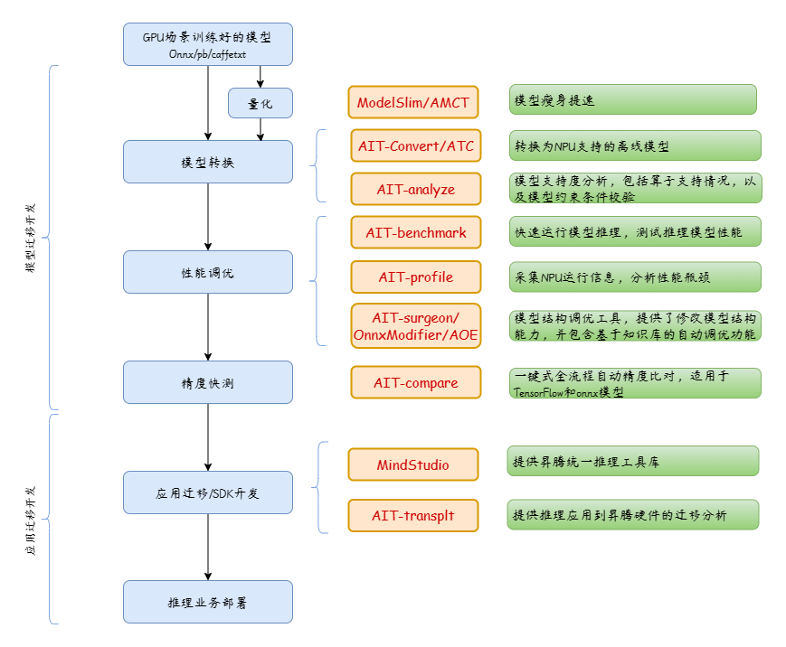

test
test
# ait

## 介绍

Ascend Inference Tools，昇腾推理工具链。 【Powered by MindStudio】

**请根据自己的需要进入对应文件夹获取工具，或者点击下面的说明链接选择需要的工具进行使用。**

### 模型推理迁移全流程

## 使用说明

1.  [ait](https://gitee.com/ascend/ait/tree/master/ait)

    **一体化推理开发工具**：作为昇腾统一推理工具，提供客户一体化开发工具，支持一站式调试调优，当前包括benchmark、debug、transplt、analyze等组件。

2.  [onnx-modifier](https://gitee.com/ascend/ait/tree/master/onnx-modifier)

    **可视化改图工具**：提供ONNX模型的实时预览、可视化改图功能，从而更方便、快捷、直观地实现ONNX模型的编辑。
3.  [ide](https://gitee.com/ascend/ait/tree/master/ide)

    **一体化推理开发工具IDE插件**：作为一体化推理工具集成IDE插件，当前集成模型转换，Ais_Bench，Compare（一键式精度比对）等组件。

#### 许可证
[Apache License 2.0](LICENSE)

