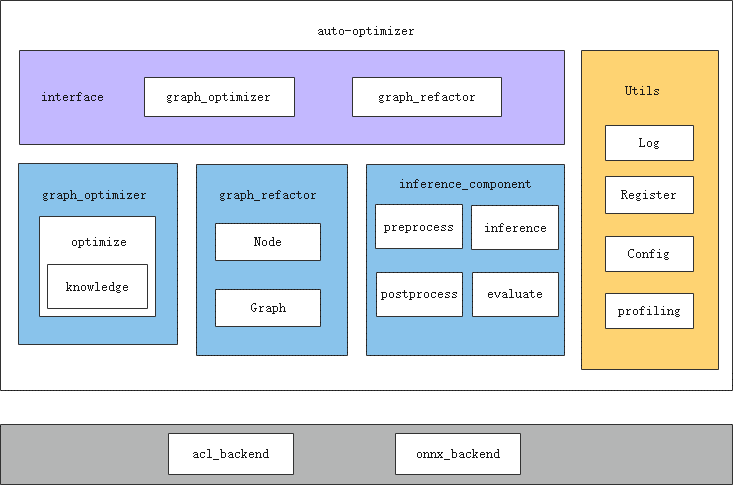

# ait debug surgeon功能使用指南

## 简介
surgeon（自动调优）使能ONNX模型在昇腾芯片的优化，并提供基于ONNX的改图功能。

**软件架构**



surgeon主要通过graph_optimizer、graph_refactor接口提供ONNX模型自动调优能力。

接口详细介绍请参见如下手册：

- [x]  graph_optimizer：基于知识库的自动改图优化。同时支持自定义知识库，详细接口请参考[knowledge](../../../components/debug/surgeon/docs/knowledge_optimizer/knowledge_optimizer_framework.md)
- [x]  graph_refactor：改图API。[graph_refactor](../../../components/debug/surgeon/auto_optimizer/graph_refactor/README.md)

## 工具安装
- 工具安装请见 [ait一体化工具使用指南](../../../README.md)

## 使用方法
### 功能介绍
#### 使用入口
surgeon功能可以直接通过ait命令行形式启动模型测试。启动方式如下：
```bash
ait debug surgeon [OPTIONS] COMMAND [ARGS]...
```
```[OPTIONS]```和```[ARGS]```为可选项以及参数，每个任务下面的可选项和参数都不同。

### 使用场景

请移步[surgeon使用示例](../../../examples/cli/debug/surgeon/)

