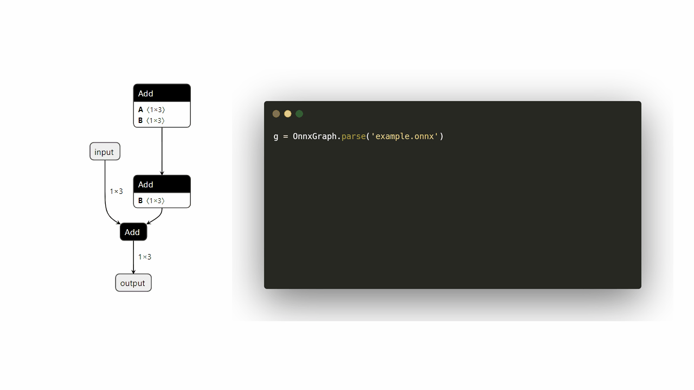

# ait debug surgeon功能使用指南

## 简介
surgeon（自动调优）使能ONNX模型在昇腾芯片的优化，并提供基于ONNX的改图功能。
## 工具安装
- 工具安装请见 [ait一体化工具使用指南](../../../README.md)

## 功能介绍

surgeon工具包含两大功能模块--面向昇腾设备的ONNX模型自动改图优化和丰富易用的ONNX改图接口。

- 工具的自动改图优化功能：基于[graph_optimizer](../../../components/debug/surgeon/docs/knowledge_optimizer/knowledge_optimizer_framework.md)图优化组件，集成业界先进的可泛化性图优化策略，构建17个改图知识库，识别模型中对应模式或子图，从而进行自动改图优化
- 工具的ONNX改图接口：基于[graph_refactor](../../../components/debug/surgeon/auto_optimizer/graph_refactor/README.md)基础改图组件，提供简易的改图接口，提供用户对ONNX图进行“增删改查”等多种改图需求的支持

## 1. 图优化工具命令行使用入口

surgeon功能可以直接通过ait命令行形式启动模型测试。启动方式如下：

```bash
ait debug surgeon COMMAND [OPTIONS] [REQUIRED]
```
**COMMAND**为surgeon工具提供的四个功能选项：**list**、**evaluate**、**optimize**和**extract**。
```[OPTIONS]```和```[REQUIRED]```为可选项和必选项参数，每个子任务下面的可选项和必选项不同。

建议使用流程：
  1. 执行**list**命令列举当前支持自动调优的所有知识库。
  2. 执行**evaluate**命令搜索可以被指定知识库优化的ONNX模型。
  3. 执行**optimize**命令使用指定的知识库来优化指定的ONNX模型。
  4. (可选)执行**extract**命令对模型进行子图切分。
  5. (可选)执行**concatenate**命令对模型进行拼接。


### list命令

命令示例如下：

```bash
ait debug surgeon list
```

输出示例如下：

```bash
Available knowledges:
   0 KnowledgeConv1d2Conv2d
   1 KnowledgeMergeConsecutiveSlice
   2 KnowledgeTransposeLargeInputConv
   3 KnowledgeMergeConsecutiveConcat
   4 KnowledgeTypeCast
   5 KnowledgeSplitQKVMatmul
   6 KnowledgeSplitLargeKernelConv
   7 KnowledgeResizeModeToNearest
   8 KnowledgeTopkFix
   9 KnowledgeMergeCasts
  10 KnowledgeEmptySliceFix 
  11 KnowledgeDynamicReshape
  12 KnowledgeGatherToSplit
  13 KnowledgeAvgPoolSplit
  14 KnowledgeBNFolding
  15 KnowledgeModifyReflectionPad
  16 KnowledgeBigKernel
```

列举的知识库按照“序号”+“知识库名称”的格式展示，**evaluate**或**optimize**命令通过**knowledges**参数指定知识库时，可指定知识库序号或名称。关于具体知识库的详细信息，请参见[知识库文档](../../../components/debug/surgeon/docs/knowledge_optimizer/knowledge_optimizer_rules.md)。

注意：序号是为了方便手动调用存在的，由于知识库可能存在被删除或修改等情况，序号可能会变化。

### evaluate命令

命令格式如下：

```bash
ait debug surgeon evaluate [OPTIONS] [REQUIRED]
```

evaluate可简写为eva。

参数说明：

| 参数        | 说明                                                                                                                                                                                                                                                           | 是否必选 |
|-----------|--------------------------------------------------------------------------------------------------------------------------------------------------------------------------------------------------------------------------------------------------------------| -------- |
| OPTIONS   | 额外参数。可取值：<br/>    -know/--knowledges：知识库列表。可指定知识库名称或序号，以英文逗号“,”分隔。默认启用除修复性质以外的所有知识库。<br/>    -r/--recursive：在PATH为文件夹时是否递归搜索。默认关闭。<br/>    -v/--verbose：打印更多信息，目前只有搜索进度。默认关闭。<br/>    -p/--processes：使用multiprocess并行搜索，指定进程数量。默认1。<br/>    --help：工具使用帮助信息。 | 否       |
| REQUIRED  | --path：evaluate的搜索目标，可以是.onnx文件或者包含.onnx文件的文件夹。                                                                                                                                                                                                              | 是       |


### optimize命令

命令格式如下：

```bash
ait debug surgeon optimize [OPTIONS] [REQUIRED]
```

optimize可简写为opt。

参数说明：

| 参数       | 说明                                                                                                                                                                                                                                                                                                                                                                                                                                                                                                                                                                                                                                                                                                                                                                                                                                                                                                                                                                                                                                                                                                                                                                                    | 是否必选 |
|----------|---------------------------------------------------------------------------------------------------------------------------------------------------------------------------------------------------------------------------------------------------------------------------------------------------------------------------------------------------------------------------------------------------------------------------------------------------------------------------------------------------------------------------------------------------------------------------------------------------------------------------------------------------------------------------------------------------------------------------------------------------------------------------------------------------------------------------------------------------------------------------------------------------------------------------------------------------------------------------------------------------------------------------------------------------------------------------------------------------------------------------------------------------------------------------------------| -------- |
| OPTIONS  | 额外参数。可取值：<br/>    -know/--knowledges：知识库列表。可指定知识库名称或序号，以英文逗号“,”分隔。默认启用除修复性质以外的所有知识库。<br/>    -bk/--big-kernel：transform类模型大kernel优化的开关，当开关开启时会启用大kernel优化知识库。关于大kernel优化的介绍请参考[示例](../../../examples/cli/debug/surgeon/06_big_kernel_optimize/README.md)<br/>    -as/--attention-start-node：第一个attention结构的起始节点，与-bk配合使用，当启用大kernel优化开关时，需要提供该参数。<br/>    -ae/--attention-end-node：第一个attention结构的结束节点，与-bk配合使用，当启用大kernel优化开关时，需要提供该参数。<br/>    -t/--infer-test：当启用这个选项时，通过对比优化前后的推理速度来决定是否使用某知识库进行调优，保证可调优的模型均为正向调优。启用该选项需要安装额外依赖[inference]，并且需要安装CANN。<br/>    -soc/--soc-version：使用的昇腾芯片版本。默认为Ascend310P3。仅当启用infer-test选项时有意义。<br/>    -d/--device：NPU设备ID。默认为0。仅当启用infer-test选项时有意义。<br/>    --loop：测试推理速度时推理次数。仅当启用infer-test选项时有意义。默认为100。<br/>    --threshold：推理速度提升阈值。仅当知识库的优化带来的提升超过这个值时才使用这个知识库，可以为负，负值表示接受负优化。默认为0，即默认只接受推理性能有提升的优化。仅当启用infer-test选项时有意义。<br/>    --input-shape：静态Shape图输入形状，ATC转换参数，可以省略。仅当启用infer-test选项时有意义。<br/>    --input-shape-range：动态Shape图形状范围，ATC转换参数。仅当启用infer-test选项时有意义。<br/>    --dynamic-shape：动态Shape图推理输入形状，推理用参数。仅当启用infer-test选项时有意义。<br/>    --output-size：动态Shape图推理输出实际size，推理用参数。仅当启用infer-test选项时有意义。<br/>    --help：工具使用帮助信息。 | 否       |
| REQUIRED | -in/--input：输入ONNX待优化模型，必须为.onnx文件。<br/>    -of/--output-file：输出ONNX模型名称，用户自定义，必须为.onnx文件。优化完成后在当前目录生成优化后ONNX模型文件。                                                                                                                                                                                                                                                                                                                                                                                                                                                                                                                                                                                                                                                                                                                                                                                                                                                                                                                                                                                                                                                                    | 是       |


### extract命令
命令格式如下：

```bash
ait debug surgeon extract [OPTIONS] [REQUIRED]
```

extract 可简写为ext

参数说明：

| 参数                    | 说明                                                                                                                                                                                                                                                                                                                                                                                                                                                             | 是否必选 |
|-----------------------|----------------------------------------------------------------------------------------------------------------------------------------------------------------------------------------------------------------------------------------------------------------------------------------------------------------------------------------------------------------------------------------------------------------------------------------------------------------|------|
| OPTIONS               | 额外参数。可取值：<br/>    -snn/--start-node-names：起始算子名称。可指定多个输入算子名称，节点之间使用","分隔。<br/>     -enn/--end-node-names：结束算子名称。可指定多个输出算子名称，节点之间使用","分隔。<br/> -ck/--is-check-subgraph：是否校验子图。启用这个选项时，会校验切分后的子图。<br/>    -sis/--subgraph-input-shape：额外参数。可指定截取子图之后的输入shape。多节点的输入shape指定按照以下格式，"input1:n1,c1,h1,w1;input2:n2,c2,h2,w2"。<br/>    -sit/--subgraph_input_dtype：额外参数。可指定截取子图之后的输入dtype。多节点的输入dtype指定按照以下格式，"input1:dtype1;input2:dtype2"。<br/>    --help：工具使用帮助信息。 | 否    |
| REQUIRED              | -in/--input：输入ONNX待优化模型，必须为.onnx文件。 <br/>    -of/--output-file：切分后的子图ONNX模型名称，用户自定义，必须为.onnx文件。<br/>                                                                                                                                                                                                                                                                                                                                                           | 是    |

使用特别说明：为保证子图切分功能正常使用且不影响推理性能，请勿指定存在**父子关系**的输入或输出节点作为切分参数。


### concatenate命令
命令格式如下：

```bash
ait debug surgeon concat [OPTIONS]
```

参数说明：

| 参数                    | 说明                                                                                                                                                                  | 是否必选 |
|-----------------------|---------------------------------------------------------------------------------------------------------------------------------------------------------------------|------|
| OPTIONS               | 额外参数。可取值：<br/>    -cgp/--combined-graph-path：拼接之后结构图的名称。默认为以下划线连接的两幅图的名称<br/>  -pref/--prefix:添加到第一幅ONNX图的前缀字符串，默认为"pre_"  <br/>  --help：工具使用帮助信息。                  | 否    |
| REQUIRED              | -g1/--graph2：输入的第一个ONNX模型，必须为.onnx文件。 <br/>    -g1/--graph2：输入的第一个ONNX模型，必须为.onnx文件。<br/>    -io/--io-map：拼接时第一幅图的输出与第二幅图的输入的映射关系。例如“g1_out1,g2_in1;g1_out2,g2_in2” | 是    |


## 2. 改图工具API使用入口

### 简介

graph_refactor 是 AutoOptimizer 工具的一个基础组件，提供简易的改图接口，解决用户改图难度大、学习成本高的问题。目前支持 onnx 模型的以下改图功能：

- [x] 加载和保存模型
- [x] 查询和修改单个节点信息
- [x] 新增节点，根据条件插入节点
- [x] 删除指定节点
- [x] 选定起始节点和结束节点，切分子图

### 快速上手



以下是一个简单的改图脚本示例，包括加载 -> 修改 -> 保存三个基本步骤：

```python
import numpy as np
from auto_optimizer import OnnxGraph

# 加载 onnx 模型
g = OnnxGraph.parse('example/magic/layernorm.onnx')

# 增加一个整网输入节点
dummy_input = g.add_input('dummy_input', 'int32', [2, 3, 4])

# 增加一个 add 算子节点和一个 const 常量节点
add = g.add_node('dummy_add', 'Add')
add_ini = g.add_initializer('add_ini', np.array([[2, 3, 4]]))
add.inputs = ['dummy_input', 'add_ini'] # 手动连边
add.outputs = ['add_out']
g.update_map() # 手动连边后需更新连边关系


# 在 add 算子节点前插入一个 argmax 节点
argmax = g.add_node('dummy_ArgMax',
                      'ArgMax',
                      attrs={'axis': 0, 'keepdims': 1, 'select_last_index': 0})
g.insert_node('dummy_add', argmax, mode='before') # 由于 argmax 为单输入单输出节点，可以不手动连边而是使用 insert 函数

# 保存修改好的 onnx 模型
g.save('layernorm_modify.onnx')

# 切分子图
g.extract_subgraph(
    "sub.onnx", 
    ["start_node_name1", "start_node_name2"],
    ["end_node_name1", "end_node_name1"],
    input_shape="input1:1,3,224,224;input2:1,3,64,64",
    input_dtype="input1:float16;input2:int8"
)

# 拼接子图
g1 = OnnxGraph.parse("g1.onnx")
g2 = OnnxGraph.parse("g2.onnx")
combined_graph = OnnxGraph.concat_graph(
  graph1=g1,
  graph2=g2,
  io_map=[("g1_output", "g2_input")]  # 两幅图的映射关系按照实际边的名称指定
)
```

### 详细使用方法


- 接口详见 [API 说明和示例](../../../components/debug/surgeon/docs/graph_refactor/graph_refactor_API.md)
- BaseNode 使用方法参见 [BaseNode 说明](../../../components/debug/surgeon/docs/graph_refactor/graph_refactor_BaseNode.md)
- BaseGraph 使用方法参见 [BaseGraph 说明](../../../components/debug/surgeon/docs/graph_refactor/graph_refactor_BaseGraph.md)

 
## 使用示例

请移步[surgeon使用示例](../../../examples/cli/debug/surgeon/)

  | 使用示例                                                                                  | 使用场景                   |
  |---------------------------------------------------------------------------------------|------------------------|
  | [01_basic_usage](../../../examples/cli/debug/surgeon/01_basic_usage)                  | 基础示例，介绍surgeon各功能      | 
  | [02_list_command](../../../examples/cli/debug/surgeon/02_list_command)                | 列举当前支持自动调优的所有知识库       | 
  | [03_evaluate_command](../../../examples/cli/debug/surgeon/03_evaluate_command)        | 搜索可以被指定知识库优化的ONNX模型    | 
  | [04_optimize_command](../../../examples/cli/debug/surgeon/04_optimize_command)        | 使用指定的知识库优化ONNX模型       | 
  | [05_extract_command](../../../examples/cli/debug/surgeon/05_extract_command)          | 对ONNX模型进行子图切分          | 
  | [06_big_kernel_optimize](../../../examples/cli/debug/surgeon/06_big_kernel_optimize)  | Transformer类模型大kernel优化 |
  | [07_concatenate_command](../../../examples/cli/debug/surgeon/07_concatenate_command)  | 对两幅ONNX图进行拼接           |
