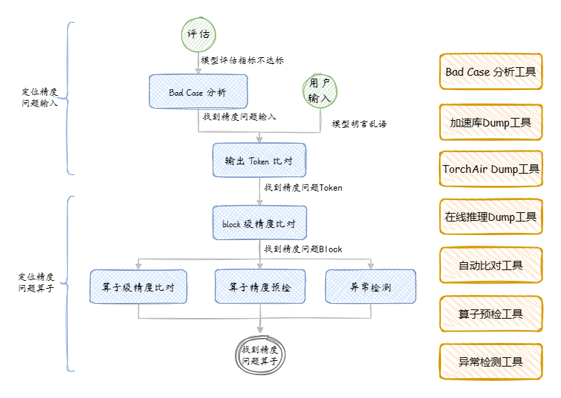

# 大模型推理精度工具（Large Language Model Debug Tool）

## 简介

目前昇腾大模型推理框架主要有 [**加速库(atb)**](../glossary/README.md#at-Ascend-Transformer-Boost) 和 [**torchair**](../glossary/README.md#torchairtorch-图模式)。在推理开发过程中可能会遇到精度问题。

大模型精度调试工具（Large Language Model Debug Tool） 用于帮助开发者快速定位推理开发过程中精度问题，发现根因，提升开发效率。

> 工具列表
> * [Bad Case 分析工具使用说明](./工具-BadCase分析使用说明.md)
> * [加速库Dump工具使用说明](./工具-DUMP加速库数据使用说明.md)
> * [在线推理Dump工具使用说明](./工具-DUMP在线推理数据使用说明.md)
> * [自动比对工具使用说明](./工具-自动比对功能使用说明.md)
> * [算子预检工具使用说明](./工具-精度预检使用说明.md)
> * [异常检测工具使用说明](./工具-异常检测使用说明.md)
> * [llm浮点模型layer层稀疏量化迁移](./工具-llm浮点模型layer层稀疏量化迁移.md)

> 场景列表
> * [输出Token的Logits精度比对--加速库场景](./加速库场景-输出Token的logits精度比对.md)
> * [整网精度比对--加速库场景](./加速库场景-整网精度比对.md)
> * [整网精度比对--TorchAir场景](./TorchAir场景-整网算子精度比对.md)
> * [手动映射比对--加速库场景](./加速库场景-手动映射比对能力说明.md)

## 大模型精度调试步骤

大模型精度调试定位，一般思路是先定位到具体存在精度问题的输入，再从整网到算子，从外到内，从粗到细逐步定位根因，具体定位操作可以视情况调整。一般分为以下步骤：

1. 定位存在精度问题的输入
   1. **Bad Case 分析**: 当数据集评估不理想，需要找到存在精度问题的Bad Case ,可以通过 [**Bad Case 分析工具**](./工具-BadCase分析使用说明.md) 定位
   2. **输出 token 比对**: 当生成任务遇到输出误差逐渐变大的场景，需要快速识别是第几个token开始出现精度问题，可以通过DUMP和比对工具识别，具体可以参考 [**输出Token的Logits精度比对--加速库场景**](./加速库场景-输出Token的logits精度比对.md)
2. 定位存在精度问题的算子
   1. **整网算子精度比对**: 当相同输入但是 npu 和 cpu(gpu)输出不一致，可以通过逐层算子比对方式定位到存在精度问题的算子。
      - 概要流程
        - 需要Dump 标杆数据和存在精度问题的数据，llm内提供了多种工具Dump数据。
        - 将Dump 数据进行自动比对或者手动比对，查找输入误差小，但是输出误差大的算子。
        - 可以由粗到细，由外到内的排查。先Dump定位哪个block存在异常，再Dump Block内部算子数据进行进一步定位。可以减少Dump的时间以及磁盘空间。
      - 排查流程详细说明文档：
        - [**整网精度比对--加速库场景**](./加速库场景-整网精度比对.md)：加速库推理场景，如何定位存在精度问题算子
        - [**整网精度比对--TorchAir场景**](./TorchAir场景-整网算子精度比对.md)：torchair 推理场景，如何定位存在精度问题算子
      - 相关功能：
        * [**加速库Dump工具使用说明**](./工具-DUMP加速库数据使用说明.md)：提供了 dump 加速库的网络结构、算子信息、推理输入输出等信息，支撑后续手动和自动比对、分析工作。
        * [**在线推理Dump工具使用说明**](./工具-DUMP在线推理数据使用说明.md)：提供了通过pytorch框架 使用 GPU/CPU/NPU 在线推理场景的网络结构、算子信息、推理输入输出等信息，支撑后续手动和自动比对、分析工作。
        * [**自动比对工具使用说明**](./工具-自动比对功能使用说明.md):提供了自动比对功能，比对标杆数据和推理数据之间的误差。
   2. **异常检测**: 定位推理过程中是否存在算子预算溢出、内存踩踏。可以参考 [**异常检测工具使用说明**](./工具-异常检测使用说明.md)
   3. **单算子精度预检**: 工具提供加速库内置算子的精度预检能力，根据模型推理时 dump 的 tensor 及算子信息，计算标杆 output，比较 dump 的算子 output 与标杆数据的误差，以检测算子精度是否达标。可以参考 [**算子预检工具使用说明**](./工具-精度预检使用说明.md)

