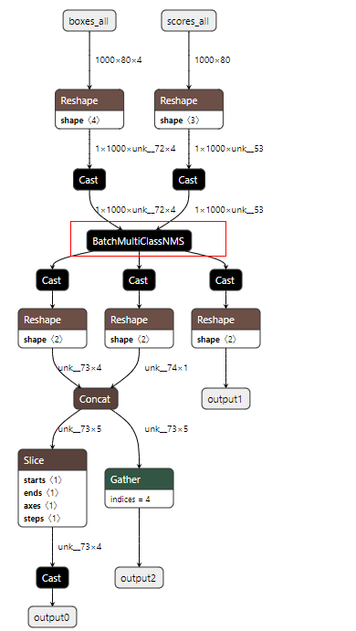

# Npu Custom op


## 介绍

某些昇腾模型，存在NPU自定义算，比如 [Retinanet](https://gitee.com/ascend/ModelZoo-PyTorch/tree/master/ACL_PyTorch/contrib/cv/detection/Retinanet)，存在BatchMultiClassNMS后处理算子，该算子无法在onnxruntime上运行，导致该模型无法使用ait debug compare功能进行精度比对。添加--custom-op参数，指定onnx模型中自定义算子名称，工具会自动拆分模型，将模型一分为二，分别获取两个子网的dump数据后，再和NPU模型的dump数据进行比对。

## 使用场景约束

1、只支持标杆模型为onnx文件；

2、onnx模型中只存在一个自定义算子；

3、通过该算子，能够将模型一分为二。


当前支持模型：[Retinanet](https://gitee.com/ascend/ModelZoo-PyTorch/tree/master/ACL_PyTorch/contrib/cv/detection/Retinanet)

例如如下模型中：



## 运行原理

- 将原模型通过custom_op，拆分成两个模型，假设名字为model_A.onnx和model_B.onnx，其中model_A.onnx为原模型输入到custom_op之前节点的子图，model_A.onnx为custom_op之后节点到原模型输出的子图；

- 在npu上，运行om模型，获取npu dump数据；

- 在cpu上，运行model_A.onnx模型，获取model_A.onnx的dump数据；

- 从npu的dump数据中，获取custom_op的输入数据，并输入数据传入model_B.onnx模型，在cpu上获取model_B.onnx的dump数据。该数据和model_A.onnx模型数据目录相同；

- 调用CANN包里的精度比对工具，比对onnx的dump数据和npu dump数据。

## 运行示例

以[Retinanet](https://gitee.com/ascend/ModelZoo-PyTorch/tree/master/ACL_PyTorch/contrib/cv/detection/Retinanet)模型为例，获取到onnx模型后，查看模型中自定义算子名称为"BatchMultiClassNMS_1203"，则命令如下：

  ```sh
  ait debug compare -gm ./model.onnx -om ./model.om -c /usr/local/Ascend/ascend-toolkit/latest -o /home/HwHiAiUser/result/test  --custom-op='BatchMultiClassNMS_1203'
  ```
  - `--custom-op` 为onnx模型中自定义算子名称