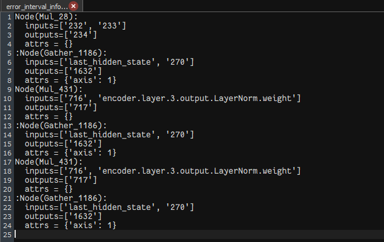

# Accuracy Error Location


## 介绍
在模型比对完成后,对首个精度问题节点进行误差定界定位,判断其是单层误差还是累计误差,并输出误差区间,信息存储在输出目录下error_interval_info.txt内.
默认为关闭,使用时使用$--locat=True$ 或者 $-l=True$.
* **注意** 使用时dump必须为True

## 运行示例
* 如果是固定过shape的动态shape模型，请先使用onnxsim将模型内所有shape信息固定.
命令如下：
```
onnxsim {input_model} {fixed_shape_input_model}
```
如果是静态onnx则跳过此步.
* 将onnx模型转为om,命令示例:
```
atc --framework=5 --output={model_name} --soc_version=Ascend310P3 --model={model_path}
```
* 执行精度比对命令,示例:
```
ait debug compare -gm {onnx_model_path} -om {om_model_path} -i {input_data_path} -o {output_file_path} -l True
```
* > onnx_model_path为onnx文件路径
* > om_model_path为atc转换后om文件路径
* > input_data_path为模型的输入文件所在路径,如无输入,可不加-i
* > output_file_path为比对结果输出路径.
- **输出结果** 参考 [01_basic_usage](../01_basic_usage/README.md)),其中误差定界定位信息输出在'{output_path}/{timestamp}/error_interval_info.txt'

## 结果

**结果解释**：每两个节点信息为一组误差区间起始节点，模型有多个输入则有多个误差区间节点对.
如：
```
Node(Mul_28): 
	inputs=['232', '233']
	outputs=['234']
	attrs = {}
:Node(Gather_1186): 
	inputs=['last_hidden_state', '270']
	outputs=['1632']
	attrs = {'axis': 1}
```
表示起始节点Mul_28到Gather_1186的误差区间