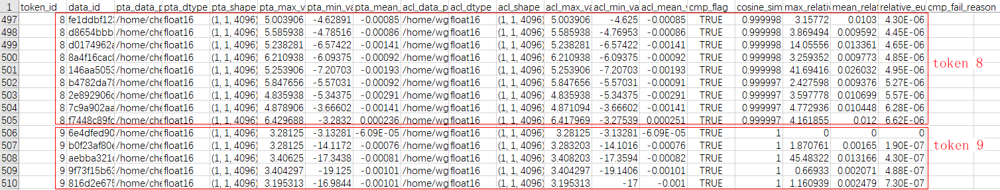

# PTA 与 ACL 加速库基于权重映射的精度比对
- 基于 weight（输入）数值，比较加速库 kernel 数据和 PT/PTA 的 API 的 weight（输入）数值，从而粗略的判断存在映射关系的加速库 kernel 和 PTA API
- 步骤：获取加速库和 PTA 框架的 weight，计算 md5 值，md5 值相等则确定对应的加速库 kernel 和 PTA API 存在映射关系
- 局限：只适用于使用了权重 weight，且存在映射关系的匹配
## 接口介绍
- **set_dump_path(dump_path=".", dump_tag="ait_dump", backend="pt", is_save_md5=False)** 设置 dump 数据目录，多卡推理时须保证每个进程都能调用该函数
  | 参数名      | 含义                   | 是否必填 | 使用说明                                                                                  |
  | ----------- | ---------------------- | -------- | ------------------------------------------------------------------------------------- |
  | dump_path   | dump 数据保存路径      | 否       | 数据类型：str，当需要dump不同对话的数据时，建议设置该参数，否则会覆盖上一轮对话的数据     |
  | dump_tag    | 设置 dump 数据目录名称 | 否       | 参数示例：dump_tag="dialog_0"，默认 dump 数据目录命名为 ait_dump                           |
  | backend     | 推理后端               | 否       | 数据类型：str，可选值 [pt, acl]，pt 表示 pytorch-npu 或 pytorch-gpu 推理，acl 表示加速库推理 |
  | is_save_md5 | 是否保存 MD5 值        | 否       | 数据类型：bool，指定保存 intensor 的 MD5 值或完整 tensor 数据，默认 False 保存 tensor 数据 |

- **register_hook(model, op_list=[])** 给模型注册钩子，获取模型中间的输出数据，仅 pytorch-npu(gpu) 推理时需要使用
  | 参数名  | 含义               | 是否必填 | 使用说明                                                                                    |
  | ------- | ------------------ | -------- | ------------------------------------------------------------------------------------------- |
  | model   | 要hook的模型       | 是       | 数据类型：torch.nn.Module                                                                   |
  | op_list | 需要hook的算子类型 | 否       | 数据类型：list，默认为 []，会对模型中所有 op 进行 hook，若设置 op_list，只会 hook 指定的 op |
## 命令行接口介绍
```sh
ait debug compare aclcmp --golden-path {PTA 侧 dump 数据} --my-path {加速库侧 dump 数据}
```
- `golden-path` 指定 PTA 侧 dump 数据路径
- `my-path` 指定加速库侧 dump 数据路径
## 使用示例
- 使用前请安装ait工具，安装指导参考：[ait 工具安装](https://gitee.com/ascend/ait/blob/master/ait/docs/install/README.md) 以 [chatglm-6b](https://gitee.com/ascend/ascend-transformer-acceleration/tree/master/examples/chatglm6b) 中 `patches/models/modeling_chatglm_model.py` 为例，介绍下如何使用加速库精度比对工具
- **加速库侧 dump 数据** 需要指定 `LD_PRELOAD` 为 ait 的 `libtensorutil.so` 覆盖加速库原本的 `SaveTensor` 接口，同时设置 `AIT_IS_SAVE_MD5` 为 `1` 指定保存 intensor 为 MD5 值，用于匹配 PTA 侧数据
  ```sh
  MSQUICKCMP_PATH=`python3 -c 'import msquickcmp; print(msquickcmp.__path__[0])'`
  export LD_PRELOAD=$MSQUICKCMP_PATH/libtensorutil.so:$LD_PRELOAD
  export AIT_IS_SAVE_MD5=1
  bash run.sh patches/models/modeling_chatglm_model.py
  ```
  生成数据位于 `$ACLTRANSFORMER_HOME_PATH/tensors/{进程 ID}` 下，其中 `$ACLTRANSFORMER_HOME_PATH` 为配置加速库时设置的
  ```sh
  ls $ACLTRANSFORMER_HOME_PATH/tensors/ -1t
  # thread_62250
  ls $ACLTRANSFORMER_HOME_PATH/tensors/thread_62250/
  # 0  1  2  3  4  5  6  7  8  9
  ```
  如发生错误 `undefined symbol: EVP_md5`，可能为 anaconda 环境中 python 使用的 `libssl.so` 与编译 `libtensorutil.so` 时使用的系统 `libssl.so` 不一致，可尝试指定 `export LD_PRELOAD=libssl.so:$LD_PRELOAD` 解决
- **PTA 侧 dump 数据** 在 `main.py` 中模型创建后添加 `register_hook`，以及 `set_dump_path` 配置 dump 路径，保存前向调用中的数据，其中每层中使用的权重 weights 将作为 MD5 值，用于匹配加速库侧数据
  ```py
  import torch
  from msquickcmp.pta_acl_cmp.pt_dump.hook import register_hook, set_dump_path

  model = AutoModel.from_pretrained("./", trust_remote_code=True).half().npu()
  # 添加
  register_hook(model)
  set_dump_path(dump_path=".", dump_tag="ait_dump",backend="pt")
  ```
  执行推理脚本 `bash run.sh patches/models/modeling_chatglm_model.py`，**输入与执行加速库侧 dump 数据时相同的输入**，查看生成数据位于 `{dump_path}/{dump_tag}/{进程 ID}` 下
- **AIT 基于权重映射的精度比对** 分别指定 `--golden-path` 为 PTA 侧 dump 数据路径，`--my-path` 为加速库侧 dump 数据路径，通过权重的 MD5 值的匹配关系，自动建立映射，输出比对结果 `cmp_report.csv` 文件
  ```sh
  ait debug compare aclcmp --golden-path ait_dump_path/25115/ --my-path ../../output/acltransformer/tensors/thread_62250
  ```
  