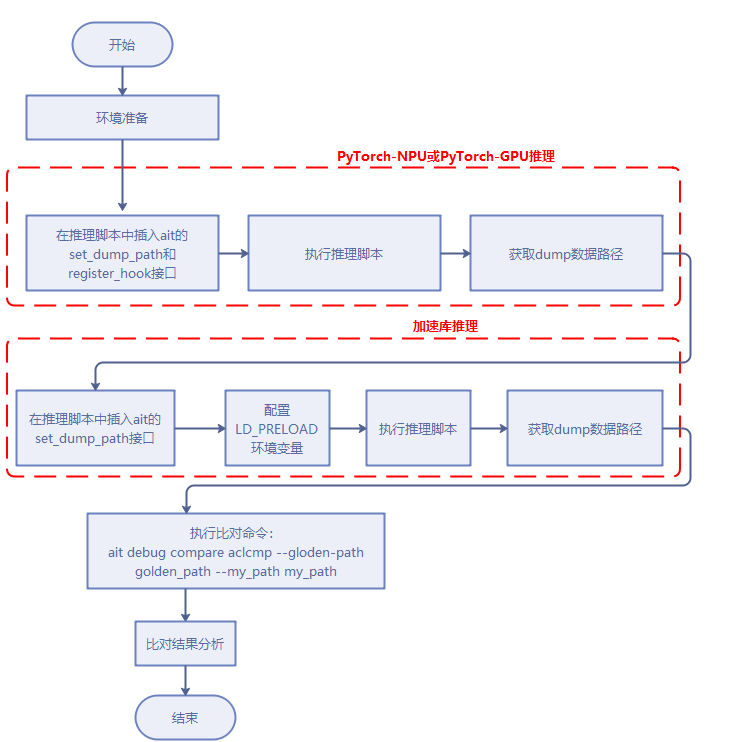
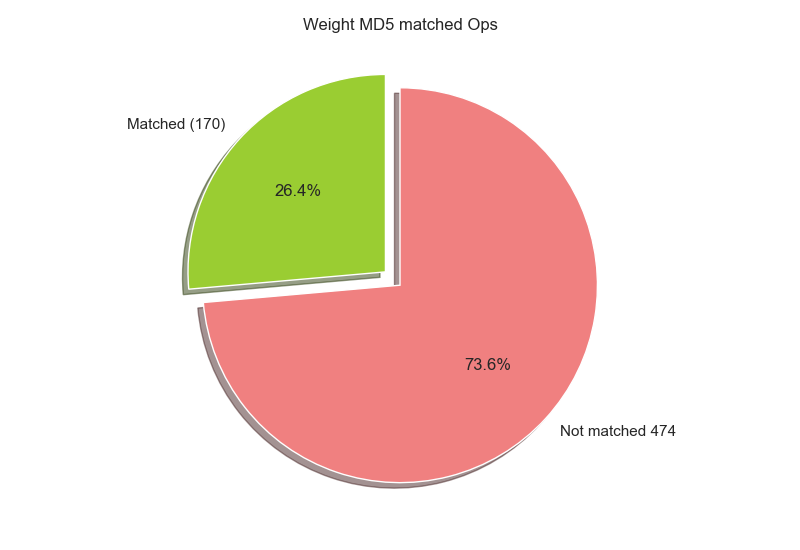

# PTA 与 ACL 加速库基于权重映射的精度比对
- 基于 weight（输入）数值，比较加速库 kernel 数据和 PT/PTA 的 API 的 weight（输入）数值，从而粗略的判断存在映射关系的加速库 kernel 和 PTA API
- 步骤：获取加速库和 PTA 框架的 weight，计算 md5 值，md5 值相等则确定对应的加速库 kernel 和 PTA API 存在映射关系
- 局限：只适用于使用了权重 weight，且存在映射关系的匹配

## 比对流程

## 接口介绍
- **set_dump_path(dump_path=".", dump_tag="ait_dump", backend="pt")** 设置 dump 数据目录，多卡推理时须保证每个进程都能调用该函数
  | 参数名      | 含义                   | 是否必填 | 使用说明                                                                                  |
  | ----------- | ---------------------- | -------- | ------------------------------------------------------------------------------------- |
  | dump_path   | dump 数据保存路径      | 否       | 数据类型：str，当需要dump不同对话的数据时，建议设置该参数，否则会覆盖上一轮对话的数据     |
  | dump_tag    | 设置 dump 数据目录名称 | 否       | 参数示例：dump_tag="dialog_0"，默认 dump 数据目录命名为 ait_dump                           |
  | backend     | 推理后端               | 否       | 数据类型：str，可选值 [pt, acl]，pt 表示 pytorch-npu 或 pytorch-gpu 推理，acl 表示加速库推理 |

- **register_hook(model, op_list=None, dump_start_token_id=0, dump_end_token_id=-1)** 给模型注册钩子，获取模型中间的输出数据，**仅 pytorch-npu(gpu) 推理时需要使用**
  | 参数名  | 含义               | 是否必填 | 使用说明                                                                                    |
  | ------- | ------------------ | -------- | ------------------------------------------------------------------------------------------- |
  | model   | 要hook的模型       | 是       | 数据类型：torch.nn.Module                                                                   |
  | op_list | 需要hook的算子类型 | 否       | 数据类型：list，默认为 None，表示会对模型中所有 op 进行 hook，若设置 op_list，只会 hook 指定的 op |
  | dump_start_token_id | dump 数据的起始 token id | 否       | 数据类型：int，默认为 0，**当加速库侧不调用 encoder ，即没有 encoder dump 数据时需要设置为 1** |
  | dump_end_token_id | dump 数据的结束 token id | 否       | 数据类型：int，默认为 -1，表示不限制结束的 token，或指定 > 0 的值表示结束的 token id |
## 命令行接口介绍
```sh
ait debug compare aclcmp --golden-path {PTA 侧 dump 数据} --my-path {加速库侧 dump 数据}
```
- `golden-path` 指定 PTA 侧 dump 数据路径
- `my-path` 指定加速库侧 dump 数据路径
## ChatGLM-6B 使用示例
- 使用前请安装ait工具，安装指导参考：[ait 工具安装](https://gitee.com/ascend/ait/blob/master/ait/docs/install/README.md) 以 chatglm-6b 中 `pytorch/examples/chatglm6b/modeling_chatglm_model_310p.py` 为例，介绍下如何使用加速库精度比对工具
- 模型权重及配置文件获取 [Huggingface THUDM/chatglm3-6b](https://huggingface.co/THUDM/chatglm3-6b)，**需要保存到加速库路径以外的地方，否则影响以后编译**
- **加速库侧 dump 数据** 需要在 `main.py` 中设置 `set_dump_path` 指定 `backend="acl"`，同时指定 `LD_PRELOAD` 为 ait 的 `libsavetensor.so` 覆盖加速库原本的 `SaveTensor` 接口，将 intensor 保存为 MD5 值，用于匹配 PTA 侧数据
  ```py
  from msquickcmp.pta_acl_cmp.pt_dump.hook import set_dump_path
  set_dump_path(backend="acl")
  ```
  同时配置其他 `ATB` dump 相关环境变量，执行推理脚本
  ```sh
  MSQUICKCMP_PATH=`python3 -c 'import msquickcmp; print(msquickcmp.__path__[0])'`
  export LD_PRELOAD=$MSQUICKCMP_PATH/libsavetensor.so:$LD_PRELOAD

  export ATB_SAVE_TENSOR=1  # 使能加速库 dump 数据，默认为 0
  export ATB_SAVE_TENSOR_END=1000  # 指定加速库侧 dump 数据最大 token 数，默认为 1
  bash run.sh patches/models/modeling_chatglm_model_310p.py
  ```
  生成数据位于 `$ASDOPS_LOG_TO_FILE_DIR/tensors/{进程 ID}_{线程ID}` 下，其中 `$ASDOPS_LOG_TO_FILE_DIR` 为配置加速库时设置的，默认值 `"atb_temp"`
  ```sh
  ls $ASDOPS_LOG_TO_FILE_DIR/tensors/ -1t
  # 25518_25518
  ls $ASDOPS_LOG_TO_FILE_DIR/tensors/25518_25518/
  # 0  1  2  3  4  5  6  7  8
  ```
  如发生错误 `undefined symbol: EVP_md5`，可能为环境中 python 使用的 `libssl.so` 与编译 `libtensorutil.so` 时使用的系统 `libssl.so` 不一致，可尝试指定 `export LD_PRELOAD=libssl.so:$LD_PRELOAD` 解决
- **PTA 侧 dump 数据** 在 `main.py` 中模型创建后添加 `register_hook`，以及 `set_dump_path` 配置 dump 路径，保存前向调用中的数据，其中每层中使用的权重 weights 或 bias 将作为 MD5 值，用于匹配加速库侧数据
  ```py
  import torch
  from msquickcmp.pta_acl_cmp.pt_dump.hook import register_hook, set_dump_path

  model = AutoModel.from_pretrained("./", trust_remote_code=True).half().npu()
  # 在模型初始化后添加
  # dump_start_token_id 需要根据实际加速库侧代码决定，当前版本的该样例加速库侧不执行 encoder，需要指定 dump_start_token_id=1
  register_hook(model, dump_start_token_id=1)
  set_dump_path(dump_path=".", dump_tag="ait_dump", backend="pt")
  ```
  执行推理脚本 `bash run.sh patches/models/modeling_chatglm_model_310p.py`，**输入与执行加速库侧 dump 数据时相同的输入**，查看生成数据位于 `{dump_path}/{dump_tag}/{进程 ID}` 下
- **AIT 基于权重映射的精度比对** 分别指定 `--golden-path` 为 PTA 侧 dump 数据路径，`--my-path` 为加速库侧 dump 数据路径，通过权重的 MD5 值的匹配关系，自动建立映射，输出比对结果 `cmp_report.csv` 文件
  ```sh
  ait debug compare aclcmp --golden-path ait_dump/25115/ --my-path atb_temp/tensors/25518_25518
  ```
  

  - 输出结果中 `token_id` 是以 0 为起始，由于 PTA 侧指定了 `dump_start_token_id=1`，`goden_data_path` `token_id==0` 对应的路径为 `1`，`acl_data_path` 对应的为 `0`
  - 该样例的比对结果中，由于加速库侧对于 ffn 层的第一个 Linear + activation 有融合操作，导致匹配到的 PTA 侧 Linear 算子节点相似度较低
- 比对结果中只能匹配到权重 MD5 完全相同的算子，由于实际计算中存在权重数据格式转化等，可能匹配到的节点数量较少，因此只作为精度异常问题的大致范围界定
  ```sh
  # 根据 dump 数据统计加速库侧 Operation 数量
  find ./atb_temp/tensors/25518_25518/1 -wholename '*Operation/*Operation/after' | wc -l
  # 644
  ```
  同时该样例 csv 表格中单个 token 的 Operation 匹配到权重 MD5 的数量为 `170`，占比 `26.4%`

  
## BLOOM-7B 使用示例
- 基本安装配置参照 `ChatGLM-6B 使用示例`，模型定义位于加速库下的 `pytorch/examples/bloom7b`
- 模型权重及配置文件获取 [Huggingface bigscience/bloom-7b1](https://huggingface.co/bigscience/bloom-7b1) 获取，**需要保存到加速库路径以外的地方，否则影响以后编译**
- **该样例加速库侧 dump 数据体积较大，可通过 `register_hook` 的 `dump_end_token_id` 参数限制 PTA 侧 dump token 数量，以及 `ATB_SAVE_TENSOR_END` 限制加速库侧 dump token 数量**
- **PTA 侧 dump 数据** 在 `run_bloom_npu.py` 的 `main` 函数中，模型创建后添加 `register_hook`，以及 `set_dump_path` 配置 dump 路径，保存前向调用中的数据
  ```py
  from msquickcmp.pta_acl_cmp.pt_dump.hook import register_hook, set_dump_path
  ...
  model, tokenizer = load_model(args)
  
  # 在模型初始化后添加，当前版本的该样例加速库侧会执行 encoder，不需要指定 dump_start_token_id
  # 指定 dump_end_token_id dump [0, 1, 2, 3, 4, 5] token 的数据
  register_hook(model, dump_end_token_id=5)
  set_dump_path(dump_path=".", dump_tag="ait_dump", backend="pt")
  ...

  # 修改脚本，只做一次推理
  # -    seq_lens = [2**x for x in range(5, 11)]
  # -    max_new_tokens_list = [2**x for x in range(5, 11)]
  seq_lens = [2**x for x in range(5, 6)]
  max_new_tokens_list = [2**x for x in range(5, 6)]  # 输出为 32 个 token
  ```
  执行推理脚本 `bash run.sh -p modeling_bloom.py --run --device 0`，查看生成数据位于 `{dump_path}/{dump_tag}/{进程 ID}` 下
- **加速库侧 dump 数据** 在 `run_bloom_npu.py` 中设置 `set_dump_path` 指定 `backend="acl"`，同时指定 `LD_PRELOAD` 为 ait 的 `libsavetensor.so` 覆盖加速库原本的 `SaveTensor` 接口，将 intensor 保存为 MD5 值，用于匹配 PTA 侧数据
  ```py
  from msquickcmp.pta_acl_cmp.pt_dump.hook import set_dump_path
  set_dump_path(backend="acl")
  ```
  同时配置其他 `ATB` dump 相关环境变量，执行推理脚本，指定 `ATB_SAVE_TENSOR_END=5` 限制只 dump 前 `[0, 1, 2, 3, 4, 5]` token 数据
  ```sh
  MSQUICKCMP_PATH=`python3 -c 'import msquickcmp; print(msquickcmp.__path__[0])'`
  export LD_PRELOAD=$MSQUICKCMP_PATH/libsavetensor.so:$LD_PRELOAD

  export ATB_SAVE_TENSOR=1  # 使能加速库 dump 数据，默认为 0
  export ATB_SAVE_TENSOR_END=5  # 只 dump 前 `[0, 1, 2, 3, 4, 5]` token 数据，默认为 1
  bash run.sh -p patches/models/modeling_bloom_model_performance.py --run --device 0
  ```
  生成数据位于 `$ASDOPS_LOG_TO_FILE_DIR/tensors/{进程 ID}_{线程ID}` 下，其中 `$ASDOPS_LOG_TO_FILE_DIR` 为配置加速库时设置的，默认值 `"atb_temp"`
  ```sh
  ls $ASDOPS_LOG_TO_FILE_DIR/tensors/ -1t
  # 18621_18621
  ls $ASDOPS_LOG_TO_FILE_DIR/tensors/18621_18621/
  # 0  1  2  3  4  5
  ```
  如发生错误 `undefined symbol: EVP_md5`，可能为环境中 python 使用的 `libssl.so` 与编译 `libtensorutil.so` 时使用的系统 `libssl.so` 不一致，可尝试指定 `export LD_PRELOAD=libssl.so:$LD_PRELOAD` 解决
- **AIT 基于权重映射的精度比对** 分别指定 `--golden-path` 为 PTA 侧 dump 数据路径，`--my-path` 为加速库侧 dump 数据路径，通过权重的 MD5 值的匹配关系，自动建立映射，输出比对结果 `cmp_report.csv` 文件
  ```sh
  ait debug compare aclcmp --golden-path ait_dump/21219 --my-path atb_temp/tensors/18621_18621
  ```
  
- 计算算子间匹配程度
  ```sh
  # 根据 dump 数据统计加速库侧 Operation 数量
  find ./atb_temp/tensors/18621_18621/1 -wholename '*Operation/*Operation/after' | grep -v 'GraphOperation/after' | wc -l
  # 690
  ```
  同时该样例 csv 表格中单个 token 的 Operation 匹配到权重 MD5 的数量为 `182`，占比 `26.4%`