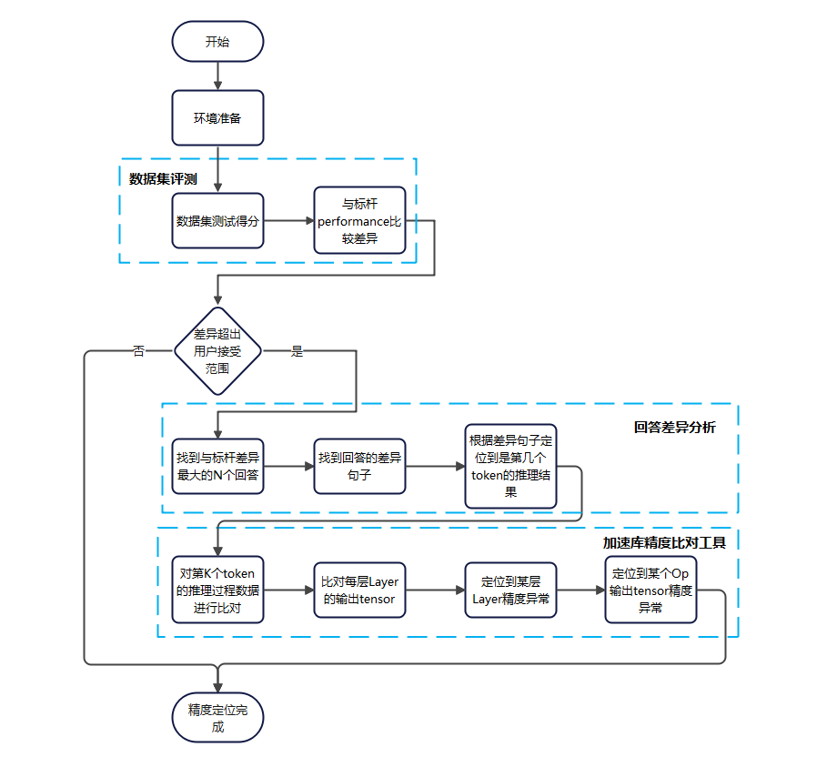

# 加速库在线推理精度比对工具介绍

## 精度问题定位流程
精度定位一般整体流程如下：

总体主要是三个步骤：数据集评测->回答差异分析->tensor差异分析
其中：
- 数据集评测是从performance这个维度评判模型精度，后续benchmark会支持自动数据集评测功能。
- 回答差异分析是从token这个维度评判模型精度，其中找到回答的差异句子后，分析差异句子的第几个词有差异，同时通过模型的token输出indices矩阵进行比较，可以判断出是哪个token轮次的推理结果有问题。
- 本工具主要完成tensor差异分析，在定位到是第K个token的推理结果问题后，可以通过自动映射比对或者半自动设置第k轮次比对来完成逐tensor比对，逐步缩小范围。

## 场景及使用方式
### 比对场景
加速库精度比对工具目前主要分为以下几个场景：

| 场景名称 | 场景介绍                                                     |
| -------- | ------------------------------------------------------------ |
| 场景一   | pytorch-npu推理与加速库推理在同一个推理脚本中，开发者一般使用torch.allclose比对加速库推理输出与pytorch-npu推理输出之间的差异，但是无法直接比对加速库内部的数据与torch-npu的差异。 | 
| 场景二   | pytorch-npu与加速库推理在两个推理脚本中，用户分别执行torch-npu推理和加速库推理，得到两份数据，以torch-npu作为基准数据，比对加速库与基准数据直接的差异。 |
| 场景三   | pytorch-gpu与加速库推理在两个推理脚本中，用户分别执行torch-gpu推理和加速库推理，得到两份数据，以torch-gpu作为基准数据，比对加速库与基准数据直接的差异。 |
| 场景四   | 以Operation（Layer）替换作为基准数据，比较Layer（Model）替换与基准的差异。 |

### 使用方式
工具有多种使用方式对应不同比对场景：
| 使用方式 | 适用场景              |限制                         |使用指导|
| -------- | ----------------------------- | ------------------------------- |-------- |
|set_label代码插入| 适用于场景一，一个推理脚本中插入set_label代码，直接完成数据比对，输出结果|只适用于同一个推理脚本中，场景二、三、四不支持|[使用指导](../11_pta_acl_cmp/basic_usage.md) |
|自动映射比对|适用场景一、二、三、四，支持自动比对，不需要人工操作|只能比对有权重的算子，不能比对用户指定的算子|[使用指导](../12_pta_acl_cmp_weight_map/README.md)|
|dump_data代码插入|适用于场景一、二、三、四，支持指定算子精度比对|需要数据落盘后额外调用工具命令进行比对|[使用指导](../13_dump_and_compare/README.md)|

### 特别说明
针对场景二和场景三，所有含有权重的算子，工具可以实现自动比对，不需要用户手动设置比对映射关系。对于部分没有权重的算子，可以使用半自动比对接口（dump_data代码插入比对），定义映射关系，进行精度比对。流程图如下：

