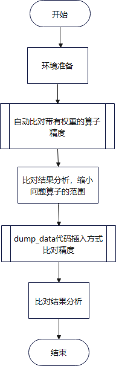

# 加速库在线推理精度比对工具介绍

## 1. 精度问题定位流程
精度定位一般整体流程如下：


总体主要是三个步骤：数据集评测->回答差异分析->tensor差异分析
其中：
- 数据集评测是从performance这个维度评判模型精度，后续benchmark会支持自动数据集评测功能。

- 回答差异分析是从token这个维度评判模型精度，其中找到回答的差异句子后，分析差异句子的第几个词有差异，同时通过模型的token输出indices矩阵进行比较，可以判断出是哪个token轮次的推理结果有问题。

- 本工具主要完成tensor差异分析，在定位到是第K个token的推理结果问题后，可以通过自动映射比对或者半自动设置第k轮次比对来完成逐tensor比对，逐步缩小范围。

## 2. 场景及使用方式

### 2.1 比对场景
加速库精度比对工具目前主要分为以下几个场景：

| 场景名称 | 场景介绍                                                     |
| -------- | ------------------------------------------------------------ |
| 场景一   | pytorch-npu推理与加速库推理在同一个推理脚本中，开发者一般使用torch.allclose比对加速库推理输出与pytorch-npu推理输出之间的差异，但是无法直接比对加速库内部的数据与torch-npu的差异。 |
| 场景二   | pytorch-npu与加速库推理在两个推理脚本中，用户分别执行torch-npu推理和加速库推理，得到两份数据，以torch-npu作为基准数据，比对加速库与基准数据直接的差异。 |
| 场景三   | pytorch-gpu与加速库推理在两个推理脚本中，用户分别执行torch-gpu推理和加速库推理，得到两份数据，以torch-gpu作为基准数据，比对加速库与基准数据直接的差异。 |
| 场景四   | 以Operation（Layer）替换作为基准数据，比较Layer（Model）替换与基准的差异。 |

### 2.2 使用方法

精度比对工具处理流程如下：


工具提供dump_data接口，在模型脚本中插入代码dump数据，然后使用ait debug compare aclcmp命令进行数据比对。
具体使用指导请参考：[dump_data代码插入使用说明](../13_dump_and_compare/README.md)

### 2.3 特别说明
#### 2.3.1 基于权重的算子自动映射比对
针对场景二和场景三，所有含有权重的算子，工具提供[自动映射比对特性](../12_pta_acl_cmp_weight_map/README.md)，不需要用户手动设置算子映射关系。对于部分没有权重的算子，可以使用[dump_data代码插入比对](../13_dump_and_compare/README.md)方式，定义映射关系，进行精度比对。工具使用流程图如下：



#### 2.3.2 set_label代码插入方式

工具提供了set_label代码插入的方式，适用于场景一，在一份推理脚本中，通过工具拉起推理进程执行推理，即可完成精度比对。

具体使用指导请参考：[set_label代码插入使用说明](../11_pta_acl_cmp/basic_usage.md)

### 2.4. allreduce通信数据比对

在大模型的推理过程中，权重切分使得大模型可以在不同的卡上同时进行推理。allreduce算子在通信过程中起到将不同卡上的权重进行相加求和的作用，以两张卡运行为例，精度比对功能在比对allreduce通信算子时，将0卡和1卡的intensor相加作为标杆数据与0卡和1卡的outtensor分别进行精度比对。

本工具主要完成allreduce通信数据比对，对于模型中每一层的"AllReduceHcclRunner"的输入输出进行误差比对，逐步缩小范围。

#### 2.4.1 allreduce通信数据比对llama_parallel场景

参考加速库资料[ascend-speed-inference - 文件 (huawei.com)](https://open.codehub.huawei.com/OpenBaize/Ascend/ascend-speed-inference/files?ref=master&filePath=pytorch%2Fexamples%2Fllama_parallel%2Freadme.md&isFile=true)进行环境配置，并且对allreduce算子前后数据进行dump

```
export ATB_SAVE_TENSOR=1
export ATB_SAVE_TENSOR_START=0
export ATB_SAVE_TENSOR_END=10
export ATB_SAVE_TENSOR_RUNNER="AllReduceHcclRunner"
bash cut_model_and_run_llama.sh
```

获取allreduce前后数据后，在`/llama_parallel/atb_temp/tensors/`目录下获得双卡上的两个进程名称，按照如下命令进行调用

```
export MSQUICKCMP_PATH=`python -c 'import os, msquickcmp; print(os.path.dirname(msquickcmp.__file__))'`
python $MSQUICKCMP_PATH/pta_acl_cmp/allreduce.py--process_0_path '/xxx/进程1/' --process_1_path '/xxx/进程2/' --output_path '生成csv路径'
```

#### 2.4.2 allreduce通信数据比对chatglm2_6b场景

参考加速库资料[ascend-speed-inference - 文件 (huawei.com)](https://open.codehub.huawei.com/OpenBaize/Ascend/ascend-speed-inference/files?ref=master&filePath=pytorch%2Fexamples%2Fchatglm2_6b%2FChatGLM2-6B%E9%87%8F%E5%8C%96%E6%8E%A8%E7%90%86%E6%8C%87%E5%AF%BC.md&isFile=true)进行环境配置，并且对allreduce算子前后数据进行dump

```export
export ATB_SAVE_TENSOR=1
export ATB_SAVE_TENSOR_START=0
export ATB_SAVE_TENSOR_END=10
export ATB_SAVE_TENSOR_RUNNER="AllReduceHcclRunner"
bash run_quant_parallel.sh patches/models/modeling_chatglm2_6b_quant_mix_parallel_fa.py --evaluate_single
```

获取allreduce前后数据后，在`/llama_parallel/atb_temp/tensors/`目录下获得双卡上的两个进程名称，按照`2.4.1`命令进行调用

#### 2.4.3 比对结果

如下表所示

| `allreduce` | `cosine_similarity`|`max_relative_error` |`mean_relative_error`|`relative_euclidean_distance` |
| --- | --- | --- |--- |--- |