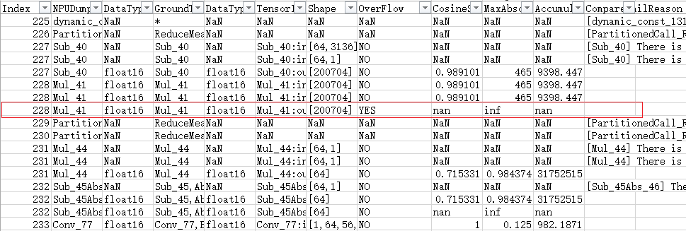
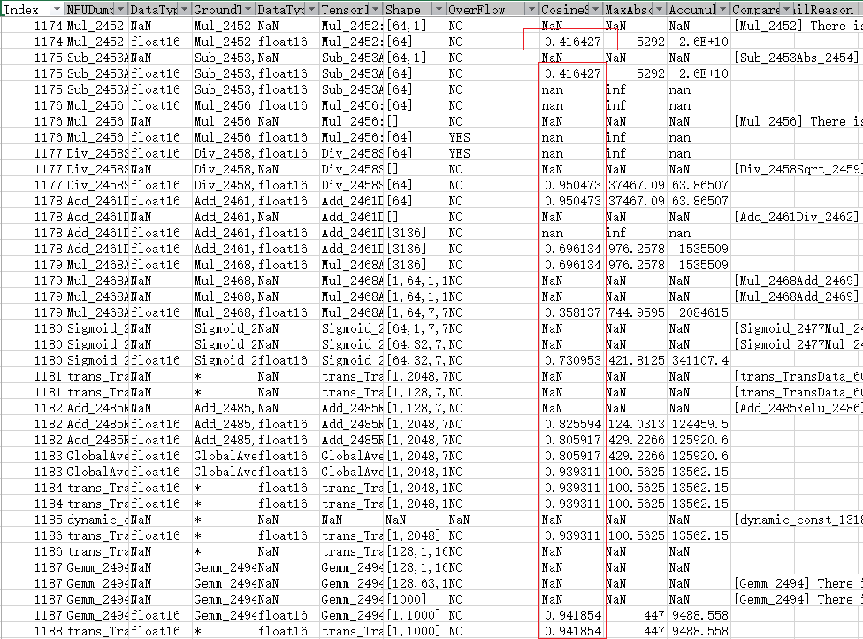
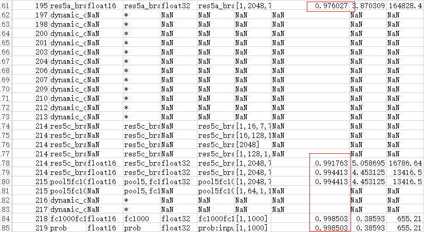

# 对比结果分析步骤


## 介绍
本节以非量化昇腾AI处理器运行生成的dump数据与非量化onnx模型npy数据比对为例进行介绍对比结果分析步骤，下文中参数说明均以该示例介绍，请根据您的实际情况进行替换。


## 对比输出结果说明

```sh
{output_path}/{timestamp}/{input_name-input_shape}  # {input_name-input_shape} 用来区分动态shape时不同的模型实际输入，静态shape时没有该层
├-- dump_data
│   ├-- npu                          # npu dump 数据目录
│   │   ├-- {timestamp}              # 模型所有npu dump的算子输出，dump为False情况下没有该目录
│   │   │   └-- 0                    # Device 设备 ID 号
│   │   │       └-- {om_model_name}  # 模型名称
│   │   │           └-- 1            # 模型 ID 号
│   │   │               ├-- 0        # 针对每个Task ID执行的次数维护一个序号，从0开始计数，该Task每dump一次数据，序号递增1
│   │   │               │   ├-- Add.8.5.1682067845380164
│   │   │               │   ├-- ...
│   │   │               │   └-- Transpose.4.1682148295048447
│   │   │               └-- 1
│   │   │                   ├-- Add.11.4.1682148323212422
│   │   │                   ├-- ...
│   │   │                   └-- Transpose.4.1682148327390978
│   │   ├-- {time_stamp}
│   │   │   ├-- input_0_0.bin
│   │   │   └-- input_0_0.npy
│   │   └-- {time_stamp}_summary.json
│   └-- {onnx or tf or caffe}        # 原模型 dump 数据存放路径，onnx / tf / caffe 分别对应 ONNX / Tensorflow / Caffe 模型
│       ├-- Add_100.0.1682148256368588.npy
│       ├-- ...
│       └-- Where_22.0.1682148253575249.npy
├-- input
│   └-- input_0.bin                  # 随机输入数据，若指定了输入数据，则该文件不存在
├-- model
│   ├-- {om_model_name}.json
│   └-- new_{om_model_name}.onnx     # 把每个算子作为输出节点后新生成的 onnx 模型
├-- result_{timestamp}.csv           # 比对结果文件
└-- tmp                              # 如果 -m 模型为 Tensorflow pb 文件, tfdbg 相关的临时目录
```

## 比对结果文件各字段含义说明
- **比对结果** 在文件 `result_{timestamp}.csv` 中，比对结果的含义与基础精度比对工具完全相同，其中每个字段的含义可参考 [CANN商用版/比对步骤（推理场景）](https://www.hiascend.com/document/detail/zh/canncommercial/60RC1/devtools/auxiliarydevtool/atlasaccuracy_16_0039.html)

* 下面简要介绍说明结果信息：
  |                  OpType |  NPUDump | DataType | Address | GroundTruth | DataType | TensorIndex|Shape|Overflow|CosineSimilarity|...|MeanRelativeError|CompareFailReason|
  |------------------------:|---------:|---------:|--------:|------------:|---------:|-----------:|----:|-------:|---------------:|--:|----------------:|----------------:|
  |                      Sub|Sub_26Mul_28| float16 |    NaN |Sub_26,Mul_28|   float32|Sub_26Mul_28:output:0|[1,1,1,108]|NO|      1|...|         0.000364|                 |
如上所示的结果文件中主要关注以下几项:
 - [x] [NPUDump]:这个对应om模型中的算子,由于融合规则,可能会对应多个GPU/CPU算子
 - [x] [DataType]:一共有两个,一个是NPU侧的数据类型,一个是CPU/GPU侧的数据类型,二者有所不同,可能会有精度损失问题.
 - [x] [GroundTruth]:om算子所对应的onnx模型算子
 - [x] [Overflow]:数据是否出现上下溢. 
 - [x] [CompareFailReason]:比对失败原因,误差可能会因为除零非法或者不对应等原因造成无法计算,变为NaN值,会列出详细原因.
 - [x] [CosineSimilarity][RelativeEuclideanDistance]...[MeanRelativeError]：这是各类误差比对类型结果,主要需要看是否某一项超过精度阈值(即某项异常),若超过则需要重点关注.各对比算法说明如下：

  |                  误差比对类型名称 |  说明 |
  |:------------------------|:---------|
  |CosineSimilarity         |进行余弦相似度算法比对出来的结果。取值范围为[-1,1]，比对的结果如果越接近1，表示两者的值越相近，越接近-1意味着两者的值越相反。|
  |MaxAbsoluteError|进行最大绝对误差算法比对出来的结果。取值范围为[0, +∞)，值越接近于0，表明越相近，值越大，表明差距越大。|
  |AccumulatedRelativeError|进行累积相对误差算法比对出来的结果。取值范围为[0, +∞)，值越接近于0，表明越相近，值越大，表明差距越大。|
  |RelativeEuclideanDistance|进行欧氏相对距离算法比对出来的结果。取值范围为[0, +∞)，值越接近于0，表明越相近，值越大，表明差距越大。|
  |KullbackLeiblerDivergence|进行KL散度算法比对出来的结果。取值范围为[0, +∞)。KL散度越小，真实分布与近似分布之间的匹配越好。|
  |StandardDeviation|进行标准差算法比对出来的结果。取值范围为[0, +∞)。标准差越小，离散度越小，表明越接近平均值。该列显示My Output和Ground Truth两组数据的均值和标准差，第一组展示My Output模型dump数据的数值(均值;标准差)，第二组展示Ground Truth模型dump数据的数值(均值;标准差)。|
  |MeanAbsoluteError|表示平均绝对误差。取值范围为[0, +∞)，MeanAbsoluteError趋于0，RootMeanSquareError趋于0，说明测量值与真实值越近似；MeanAbsoluteError趋于0，RootMeanSquareError越大，说明存在局部过大的异常值；MeanAbsoluteError越大，RootMeanSquareError等于或近似MeanAbsoluteError，说明整体偏差越集中；MeanAbsoluteError越大，RootMeanSquareError越大于MeanAbsoluteError，说明存在整体偏差，且整体偏差分布分散；不存在以上情况的例外情况，因为RMSE(RootMeanSquareError) ≥ MAE(MeanAbsoluteError)恒成立。|
  |RootMeanSquareError|表示均方根误差。取值范围为[0, +∞)，MeanAbsoluteError趋于0，RootMeanSquareError趋于0，说明测量值与真实值越近似；MeanAbsoluteError趋于0，RootMeanSquareError越大，说明存在局部过大的异常值；MeanAbsoluteError越大，RootMeanSquareError等于或近似MeanAbsoluteError，说明整体偏差越集中；MeanAbsoluteError越大，RootMeanSquareError越大于MeanAbsoluteError，说明存在整体偏差，且整体偏差分布分散；不存在以上情况的例外情况，因为RMSE(RootMeanSquareError) ≥ MAE(MeanAbsoluteError)恒成立。|
  |MaxRelativeError|表示最大相对误差。取值范围为[0, +∞)，值越接近于0，表明越相近，值越大，表明差距越大。|
  |MeanRelativeError|表示平均相对误差。取值范围为[0, +∞)，值越接近于0，表明越相近，值越大，表明差距越大。|


## 比对结果分析
- **analyser 分析结果** 在调用结束后在屏幕上打印，在全部对比完成后，逐行分析数据，排除 nan 数据，输出需要重点关注的各误差对比算法中、首个差距不在阈值范围内的算子。

  | 误差对比算法                | 阈值   |
  | ------------------------- | ------ |
  | CosineSimilarity          | <0.99  |
  | RelativeEuclideanDistance | >0.05  |
  | KullbackLeiblerDivergence | >0.005 |
  | RootMeanSquareError       | >1.0   |
  | MeanRelativeError         | >1.0   |

  输出结果使用 markdown 表格显示
  ```sh
  2023-04-19 13:54:10(1005)-[INFO]Operators may lead to inaccuracy:

  |                   Monitor |  Value | Index | OpType | NPUDump | GroundTruth |
  |--------------------------:|-------:|------:|-------:|--------:|------------:|
  |          CosineSimilarity | 0.6722 |   214 |    Mul |   Mul_6 |       Mul_6 |
  | RelativeEuclideanDistance |      1 |   214 |    Mul |   Mul_6 |       Mul_6 |
  ```
  比如上面的结果中，表格第一行表示：第一次出现CosineSimilarity（余弦相识度）<0.99的算子，是Index为214、OpType为Mul、NPU侧算子名为**Mul_6**的算子，进行余弦相似度算法比对出来的结果，取值范围为[-1,1]，比对的结果如果越接近1，表示两者的值越相近，越接近-1意味着两者的值越相反。

## 比对结果专家建议

  使用方法，添加--advisor参数：
  ```sh
  ait debug compare -gm /home/HwHiAiUser/onnx_prouce_data/resnet_offical.onnx -om /home/HwHiAiUser/onnx_prouce_data/model/resnet50.om \
  -c /usr/local/Ascend/ascend-toolkit/latest -o /home/HwHiAiUser/result/test --advisor
  ```

- **FP16溢出检测**：针对比对数据中数据类型为Float16的数据，进行溢出检测。如果存在溢出数据，会在屏幕上输出专家建议。
    
    以如下结果为例：

    

    算子ID为228的数据，存在FP16数据溢出，专家系统分析结果：
    ```
    Detection Type: FP16 overflow

    Operator Index: 228

    Expert Advice: Float16 data overflow occurs. Rectify the fault and perform comparison again.

    检测类型：FP16溢出检测

    Operator Index：228

    专家建议：存在Float16数据溢出，请修正溢出问题，再进行比对。
    ```

- **问题节点检测**：判断整网比对结果中，是否某层小于阈值，该层后续数据均小于阈值或最后一层小于阈值（余弦相似度<0.99），输出量化误差修正建议。
    
    以如下结果为例：

    

    算子ID为1174的数据，余弦相似度小于0.99，且后续余弦相似度均小于0.99，判断问题节点存在精度问题。

    专家系统分析结果：
    ```
    Detection Type: global consistency

    Operator Index: 1174

    Expert Advice: The accuracy of some tensors is low, resulting in an unqualified final accuracy. This may be caused by quantization. Calibrate the data or contact Huawei for further diagnosis.

    检测类型：整网一致性检测

    Operator Index：1174

    专家建议：部分张量精度较低，且导致最终结果精度不达标；很可能由量化造成，请进行数据校准或者反馈给华为做进一步定位。    
    
    ```

- **单点误差检测**：判断整网比对结果中，是否某层小于阈值（余弦相似度<0.99），但最终结果符合精度要求。
    
    以如下结果为例：

    

    算子ID为195的数据，余弦相似度小于0.99，但最后一层数据符合精度要求，判断为单点误差。

    专家系统分析结果：
    ```
    Detection Type: global consistency

    Operator Index: 195

    Expert Advice: The accuracy of some tensors is low, while the final accuracy is qualified. This may be caused by Ascend internal optimization. Ignore or contact Huawei for further diagnosis.

    检测类型：整网一致性检测

    Operator Index：195

    专家建议：部分张量精度较低，但最终结果精度达标，可能由内部优化导致，请忽略或反馈给华为做进一步定位。  
        
    ```

- **一致性检测**：比对结果中的所有数据均符合精度要求，输出专家建议。

    所有数据均符合精度要求，判断模型符合精度要求。

    专家系统分析结果：
    ```
    Detection Type: global consistency

    Operator Index: NA

    Expert Advice: All data in the comparison result meets the accuracy requirements.

    If data accuracy of the model is still not up to standard in practical application, please check the post-processing process of model outputs.

    检测类型：整网一致性检测

    Operator Index：NA

    专家建议：比对结果中的所有数据均符合精度要求。
    ```
    如果模型实际应用中，精度依旧不达标，请排查输出数据的后处理流程。
