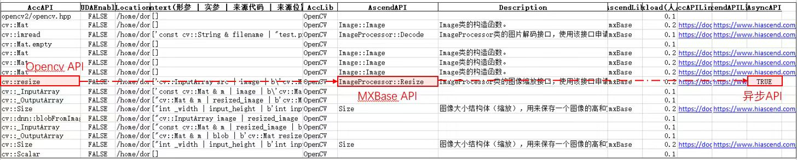

# 迁移DVPP高性能example
- 示例将 OpenCV 上 ResNet50 的 onnx 模型推理迁移到昇腾平台 MXBase + AIPP 进行异步推理和异步接口的使用

## 导出 ResNet50 onnx 文件
- 需要 `resnet50.onnx` 文件用于后续推理以及迁移，使用 `torchvision` 中预定义的模型导出
  ```py
  import torchvision, torch
  mm = torchvision.models.resnet50(pretrained=True)
  torch.onnx.export(mm, torch.ones([1, 3, 224, 224]), 'resnet50.onnx')
  ```
## 准备测试图片
- 使用 `scikit-image` 中的测试图片，也可使用自行获取的图片，**本样例中限定输入图片大小 `256 x 256`**
  ```py
  import cv2
  from skimage.data import chelsea
  cv2.imwrite('test.png', cv2.resize(chelsea(), [256, 256])[:, :, ::-1])
  ```
## OpenCV ResNet50 推理
- **相关依赖** 需要 `opencv4`
  ```
  sudo apt install libopencv-dev
  ```
  如安装失败，可使用源码编译
  ```
  git clone https://github.com/opencv/opencv.git
  cd opencv
  mkdir build && cd build && cmake .. && make
  cd -
  ```
- **编译执行**
  ```sh
  g++ -O3 resnet50_opencv.cpp -o resnet50_opencv `pkg-config --cflags --libs opencv4`
  ./resnet50_opencv
  # Image process time duration: 19.5392ms
  # Model inference time duration: 396.602ms
  # index: 285
  # score: 17.6409
  ```
## AIT Tranplt 迁移分析
  - 安装 ait 工具后，针对待迁移项目执行 transplt 迁移分析
  ```sh
  ait transplt -s .
  # INFO - scan_api.py[123] - Scan source files...
  # ...
  # INFO - csv_report.py[46] - Report generated at: ./output.xlsx
  # INFO - scan_api.py[113] - **** Project analysis finished <<<
  ```
  最终分析结果文件位于当前执行路径下 `./output.xlsx`，结果中重点关注有异步对应关系的接口，并参照 `AscendAPILink` 中相关接口说明辅助完成迁移

  
## MXBase ResNet50 异步推理 + AIPP 数据处理
- **完成该部分迁移，可使用 MXBase 在昇腾 NPU 上执行图像推理 -> 模型异步推理**
- 分析结果中，模型推理相关的异步 API
  | AccAPI               | AscendAPI              | Description                 | AsyncAPI  |
  | -------------------- | --------------------   | --------------------------- | --------- |
  | cv::resize           | ImageProcessor::Resize | ImageProcessor类的图像缩放接口 | TRUE      |
- [MindX SDK 社区版](https://gitee.com/link?target=https%3A%2F%2Fwww.hiascend.com%2Fzh%2Fsoftware%2Fmindx-sdk%2Fcommunity) 下载安装 Ascend-mindxsdk-mxvision.
  ```sh
  ./Ascend-mindxsdk-mxvision_5.0.RC2_linux-aarch64.run --install
  source ./mxVision/set_env.sh
  ```
  安装成功并 source 后，`echo $MX_SDK_HOME` 不为空

- **AIPP** 详细介绍参照 [CANN AIPP使能](https://www.hiascend.com/document/detail/zh/CANNCommunityEdition/63RC2alpha003/infacldevg/atctool/atlasatc_16_0018.html)，对于 `resnet50` 的参考实现 `aipp.config`
  ```java
  aipp_op{
      aipp_mode:static
      input_format : RGB888_U8

      src_image_size_w: 224
      src_image_size_h: 224

      min_chn_0 : 123.675
      min_chn_1 : 116.28
      min_chn_2 : 103.53
      var_reci_chn_0: 0.0171247538316637
      var_reci_chn_1: 0.0175070028011204
      var_reci_chn_2: 0.0174291938997821
  }
  ```
- **转出带 AIPP 前处理的 om 模型**，其中 AIPP 负责将输入的 `256 x 256` 图像裁剪为 `224 x 224`，以及数值规范化
  ```sh
  SOC_VERSION=`python3 -c 'import acl; print(acl.get_soc_name())'`  # Ascend310 / Ascend310P3 or others
  atc --model resnet50.onnx --output resnet50_aipp_async --framework 5 --soc_version $SOC_VERSION --insert_op_conf aipp_async.config
  ```
- **ImageProcessor::Decode 图像解码** 参照 `AscendAPILink` 中链接 [mxVision 用户指南 Decode](https://www.hiascend.com/document/detail/zh/mind-sdk/300/vision/mxvisionug/mxmanufactureug_0856.html)
  ```cpp
  // inputPath 输入待解码的图片路径
  // outputImage 输出解码后的Image类，图片宽高和对齐后的宽高会自动合入进“outputImage”内
  // decodeFormat 输入解码后图片的格式，JPG/JPEG默认参数为YUV_SP_420，PNG图片无需设置，按图片源格式进行解码
  APP_ERROR Decode(const std::string inputPath, Image& outputImage,
                   const ImageFormat decodeFormat = ImageFormat::YUV_SP_420);
  ```
  对应 OpenCV 部分
  ```cpp
  cv::Mat image = cv::imread("test.png", 1);
  ```
  完成对应图像解码迁移实现
  ```cpp
  std::string img_file = "test.png";
  MxBase::ImageProcessor processor;
  MxBase::Image decoded_image;
  processor.Decode(img_file, decoded_image, MxBase::ImageFormat::RGB_888);
  ```
- 创建目标deviceId的stream，参照[mxVision 用户指南 CreateAscendStream](https://www.hiascend.com/document/detail/zh/mind-sdk/50rc3/vision/mxvisionug/mxvisionug_0864.html)
  ```cpp
  // `deviceId` 输入模型部署的芯片，默认为0号芯片（-1表示模型部署在Host侧，为保留字段，请勿使用）
  // `CreateAscendStream` 在当前进程或线程创建一个Stream（同一设备（deviceId），Stream最大支持创建1021个）
  MxBase::AscendStream stream(device_id);
  stream.CreateAscendStream();
  ```
  
- **`Resize` 图像的异步缩放接口调用，参照[mxVision 用户指南 ImageProcessor Resize](https://www.hiascend.com/document/detail/zh/mind-sdk/50rc3/vision/mxvisionug/mxvisionug_0747.html)
- ```cpp
  // `resized_image` 缩放后的图像类实例
  MxBase::Image resized_image;
  // 异步调用缩放接口，MxBase::Interpolation::HUAWEI_HIGH_ORDER_FILTER华为自研的高滤波算法。
  imageProcessor.Resize(decoded_image, MxBase::Size(input_height, input_width), resized_image, MxBase::Interpolation::HUAWEI_HIGH_ORDER_FILTER, stream);
  // 显式同步Stream，保证异步执行结果在作为下一个接口入参时已执行完成
  stream.Synchronize();
  ```
  对应 OpenCV 部分
  ```cpp
  // 图片的缩放
  cv::resize(image, resized_image, cv::Size(input_height, input_width));
  ```
- 构造推理输入输出，构造的输出outputTensors，使用TensorMalloc()申请输出的Tensor内存,自由度更高
  ```cpp
  // 获取输出tensor的shape
  const std::vector<uint32_t> shape = net.GetOutputTensorShape(index);
  // 获取输出tensor的数量
  uint32_t num_outputs = net.GetOutputTensorNum();
  // 创建输出tensor的容器
  std::vector<MxBase::Tensor> outputs;
  outputs.resize(num_outputs);
  // 创建容器中tensor并分配内存
  for (size_t i = 0; i < num_outputs; ++i) {
      outputs[i] = MxBase::Tensor(shape, MxBase::TensorDType::FLOAT32, device_id);
      MxBase::Tensor::TensorMalloc(outputs[i]);}
  ```
- 模型异步推理部分
  ```cpp
  // resnet50模型推理
  MxBase::Model net(modelPath, device_id);
  // mx_inputs,outputs输入输出为MXBas::Tensor 数据，stream异步推理
  ret = net.Infer(mx_inputs,outputs,stream);
  ```
  对应 OpenCV 部分
  ```cpp
  std::vector<cv::Mat> outputs;
  net.forward(outputs, net.getUnconnectedOutLayersNames());
  ```
  
- 调用DestroyAscendStream销毁stream，参照[mxVision 用户指南 DestroyAscendStream](https://www.hiascend.com/document/detail/zh/mind-sdk/50rc3/vision/mxvisionug/mxvisionug_0865.html)
  ```cpp
  // 销毁stream,否则可能造成Stream耗尽情况
  stream.DestroyAscendStream();
  ```  

- **编译执行** 迁移完成后可使用 `g++` 编译，也可自行编写 `cmake` 文件，修改调整至可编译通过并正确执行，参考迁移后实现 [resnet50_mxbase_async.cpp](https://gitee.com/ascend/ait/tree/master/ait/examples/cli/transplt/02_resnet50_inference/resnet50_mxbase.cpp)
  ```sh
  g++ -O3 resnet50_mxbase_aipp_async.cpp -o resnet50_mxbase_aipp_async -lmxbase -lopencv_world \
  -L ${MX_SDK_HOME}/lib -L ${MX_SDK_HOME}/opensource/lib -D_GLIBCXX_USE_CXX11_ABI=0 \
  -I ${MX_SDK_HOME}/include/ -I ${MX_SDK_HOME}/opensource/include/opencv4 -I ${MX_SDK_HOME}/opensource/include

  ./resnet50_mxbase_aipp_async
  # Image process time duration: 13.6002ms
  # Model inference time duration: 1.7477ms
  # index: 285
  # score: 17.75
  ```
  其中在 NPU 上执行时图片处理时间 **13.6002ms** 小于 CPU 上 OpenCV 调用时的 `19.5392ms` , 模型推理时间 **1.7477ms** 远小于 CPU 上 OpenCV 调用时的 `230.819ms`，且输出结果 `score` 相近