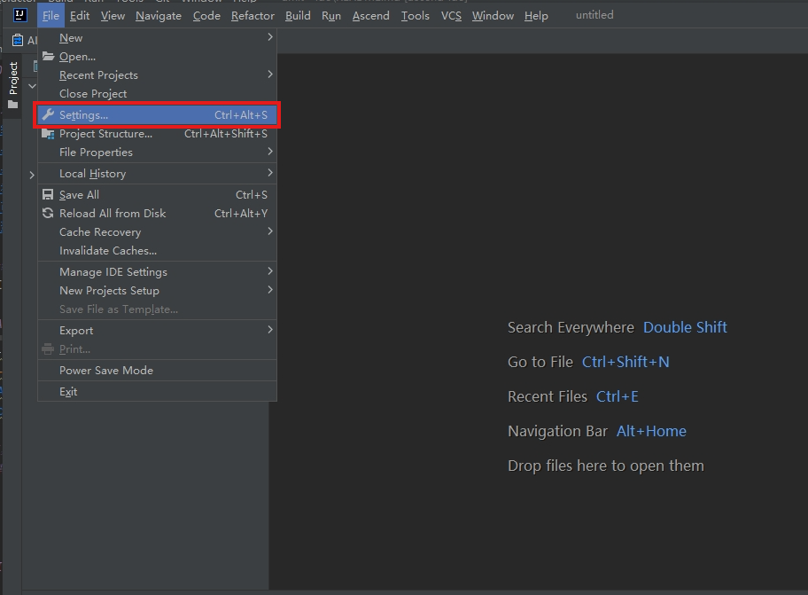
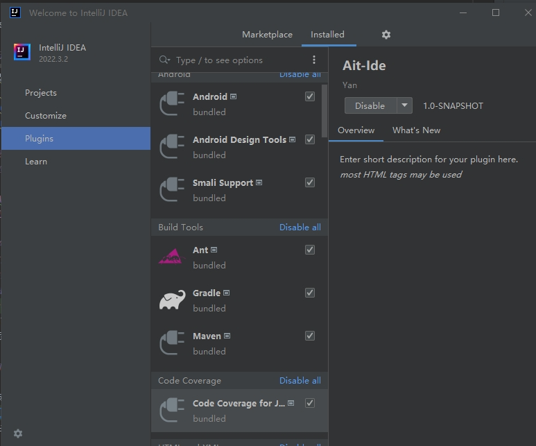
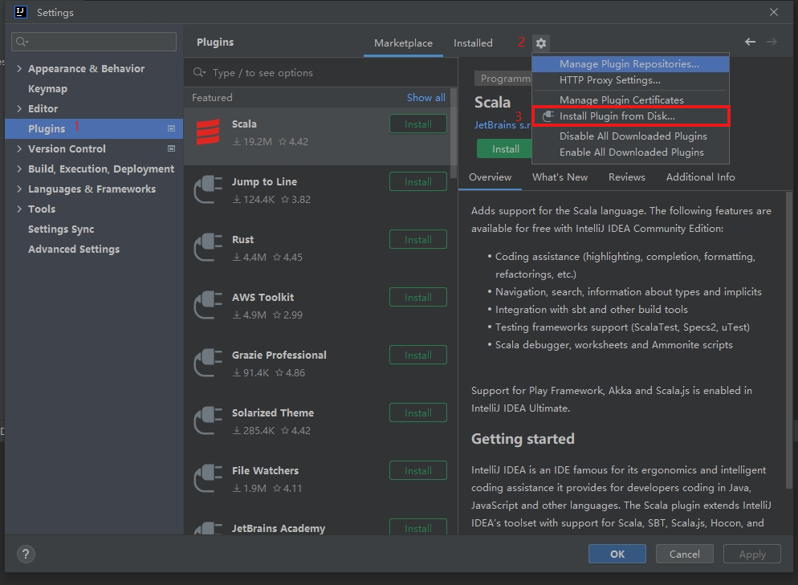
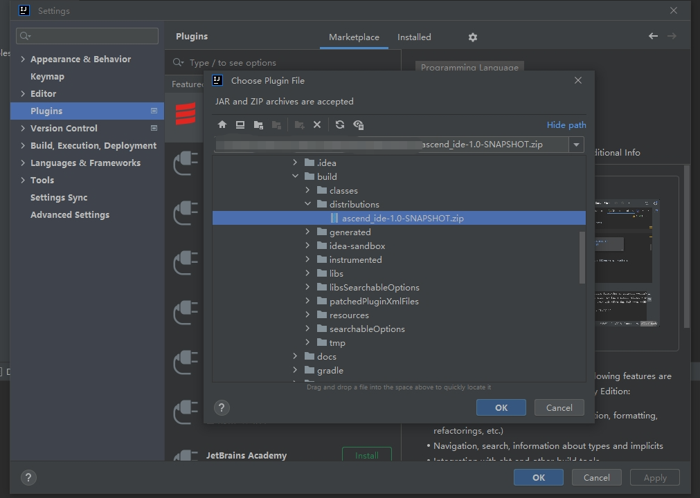
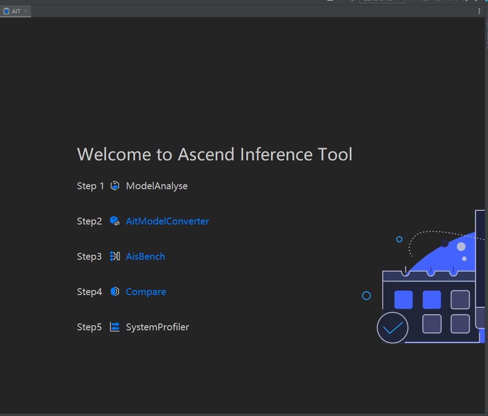
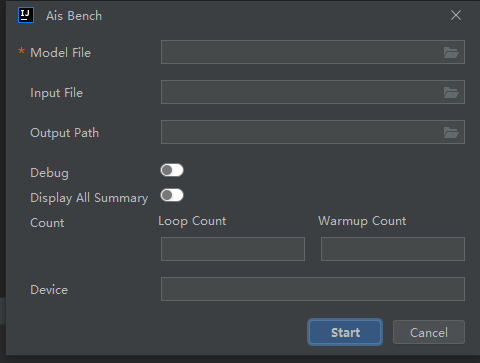
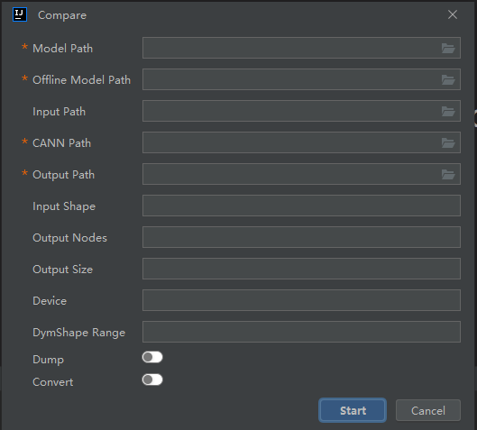
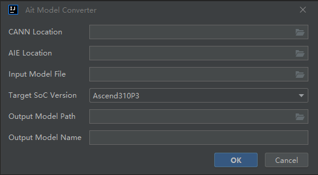

#  IDE

## 目录
- [介绍](#介绍)
- [工具安装](#工具安装)
- [工具使用](#工具使用)
- [参考](#参考)
- [许可证](#许可证)
- [免责声明](#免责声明)

## 介绍
AIT-IDE(Ascend Inference Tools)作为昇腾统一推理工具，提供客户一体化开发工具，支持一站式调试调优，当前包括模型转换，Ais_Bench，Compare（一键式精度比对）等组件。

### AIT各子功能介绍
| 任务类型                                                                                       | 说明                                       | 入口        |
|--------------------------------------------------------------------------------------------|------------------------------------------|-----------|
| [Ais_Bench](https://gitee.com/ascend/ait/blob/master/ait/components/benchmark/README.md)   | 用来针对指定的推理模型运行推理程序，并能够测试推理模型的性能（包括吞吐率、时延） | Ais_Bench |                
| [compare](https://gitee.com/ascend/ait/blob/master/ait/components/debug/compare/README.md) | 提供自动化的推理场景精度比对，用来定位问题算子                  | Compare   |
| [convert](https://gitee.com/ascend/ait/blob/master/ait/components/convert/README.md)       | Convert模型转换工具依托AIE（Ascend Inference Engine）推理引擎，提供由ONNX模型转换至om模型的功能                  | Convert   |

## 工具安装
### 背景：安装CANN以及Ait插件

#### 1：CANN包安装： 安装开发运行环境的昇腾 AI 推理相关驱动、固件、CANN 包，参照 [昇腾文档](https://www.hiascend.com/zh/document)。安装后用户可通过 **设置CANN_PATH环境变量** ，指定安装的CANN版本路径，例如：export CANN_PATH=/xxx/nnrt/latest/。若不设置，工具默认会从/usr/local/Ascend/nnrt/latest/和/usr/local/Ascend/ascend-toolkit/latest路径分别尝试获取CANN版本。
#### 2：Ait-Compare安装：[一体化安装指导](https://gitee.com/ascend/ait/blob/master/ait/docs/install/README.md)
#### 3: Ais_Bench安装： [Ais_Bench安装指导](https://gitee.com/ascend/ait/tree/master/ait/components/benchmark)

### Ide插件安装
#### 1：下载插件包：[ascend_ide-1.0-SNAPSHOT.zip](https://mindstudio-sample.obs.cn-north-4.myhuaweicloud.com/Ascend-Inference-Tools-IDE-plugin/Ascend-Inference-Tools-IDE-plugin-1.0.zip)
#### 2：安装插件包
##### 点击File下Setting进入Plugin

##### 或者在开始页面点击进入

##### 进入Plugin下操作 

##### 选取下载的插件zip

##### 重启IDEA

## 工具使用

启动说明：点击Ascend下Ait进入主页

(蓝色字体代表插件安装正常，可以正常使用，灰色字体代表对应需要的插件没有安装。)

提示：如果需要使用Model Analyse，SystemProfiler需要安装对应的MindStudio插件。

## Ais_Bench

（红色星号代表必选配置）

### 参数解析：

| 参数名                 | 说明                                                                                                                                          | 是否必选 |
|---------------------|---------------------------------------------------------------------------------------------------------------------------------------------|------|
| Model File          | 需要进行推理的OM离线模型文件。                                                                                                                            | 是    |
| Input File          | 模型需要的输入。可指定输入文件所在目录或直接指定输入文件。支持输入文件格式为“NPY”、“BIN”。可输入多个文件或目录，文件或目录之间用“,”隔开。具体输入文件请根据模型要求准备。  若不配置该参数，会自动构造输入数据，输入数据类型由--pure_data_type参数决定。 | 否    |
| Pure Data Type      | 纯推理数据类型。取值为：“zero”、“random”，默认值为"zero"。 未配置模型输入文件时，工具自动构造输入数据。设置为zero时，构造全为0的纯推理数据；设置为random时，为每一个输入生成一组随机数据。                               | 否    |
| Output              | 推理结果保存目录。配置后会创建“日期+时间”的子目录，保存输出结果。如果指定output_dirname参数，输出结果将保存到子目录output_dirname下。不配置输出目录时，仅打印输出结果，不保存输出结果。                                 | 否    |
| Output Dirname      | 推理结果保存子目录。设置该值时输出结果将保存到*output/output_dirname*目录下。  配合output参数使用，单独使用无效。                                                                    | 否    |
| Outfmt              | 输出数据的格式。取值为：“NPY”、“BIN”、“TXT”，默认为”BIN“。  配合output参数使用，单独使用无效。                                                                               | 否    |
| Debug               | 调试开关。可打印model的desc信息和其他详细执行信息。默认关闭。                                                                                                         | 否    |
| Display all summary | 是否显示所有的汇总信息，包含h2d和d2h信息。默认关闭。                                                                                                               | 否    |
| loop                | 推理次数。默认值为1，取值范围为大于0的正整数。  profiler参数配置为true时，推荐配置为1。                                                                                        | 否    |
| warmup_count        | 推理预热次数。默认值为1，取值范围为大于等于0的整数。配置为0则表示不预热。                                                                                                      | 否    |
| Device              | 指定运行设备。根据设备实际的Device ID指定，默认值为0。多Device场景下，可以同时指定多个Device进行推理测试，例如：0,1,2,3。                                                                 | 否    |

## Compare

（红色星号代表必选配置）

### 参数解析：

| 参数名                | 描述                                                                                                                                                                                                              | 必选 |
  |--------------------|-----------------------------------------------------------------------------------------------------------------------------------------------------------------------------------------------------------------|----|
| Model Path         | 模型文件（.pb或.onnx)路径，目前只支持pb模型与onnx模型                                                                                                                                                                              | 是  |
| Offline Model Path | 昇腾AI处理器的离线模型（.om）                                                                                                                                                                                               | 是  |
| Input File/Path    | 模型的输入数据路径，默认根据模型的input随机生成，多个输入以逗号分隔，例如：/home/input\_0.bin,/home/input\_1.bin                                                                                                                                   | 否  |
| CANN Path          | CANN包安装完后路径                                                                                                                                                                                                     | 是  |
| Output Path        | 输出文件路径                                                                                                                                                                                                          | 是  |
| Input Shape        | 模型输入的shape信息，默认为空，例如input_name1:1,224,224,3;input_name2:3,300,节点中间使用英文分号隔开。input_name必须是转换前的网络模型中的节点名称                                                                                                          | 否  |
| Device             | 指定运行设备 [0,255]，可选参数，默认0                                                                                                                                                                                         | 否  |
| Output Nodes       | 用户指定的输出节点。多个节点用英文分号（;）隔开。例如:node_name1:0;node_name2:1;node_name3:0                                                                                                                                              | 否  |
| Output Size        | 指定模型的输出size，有几个输出，就设几个值。动态shape场景下，获取模型的输出size可能为0，用户需根据输入的shape预估一个较合适的值去申请内存。多个输出size用英文分号（,）隔开, 例如"10000,10000,10000"                                                                                        | 否  |
| Advisor            | 在比对结束后，针对比对结果进行数据分析，给出专家建议                                                                                                                                                                                      | 否  |
| Dump               | 是否dump所有算子的输出并进行精度对比。默认是True，即开启全部算子输出的比对。(仅支持onnx模型) 使用方式：默认开启。                                                                                                                                            | 否  |
| Convert            | 支持om比对结果文件数据格式由bin文件转为npy文件，生成的npy文件目录为./dump_data/npu/{时间戳_bin2npy} 文件夹。使用方式：默认关闭。                                                                                                                             | 否  |

## AitModelConvert

### 参数解析：

| 参数名                | 描述                          | 必选 |
  |--------------------|-----------------------------|----|
| CANN Location      | Ascend-cann-toolkit开发套件包的安装路径 | 是  |
| AIE Location       | Ascend-cann-aie-api开发套件包的安装路径 | 是  |
| Input Model File   | 输入模型文件，当前仅支持onnx模型文件        | 是  |
| Target SoC Version | 模型转换时指定芯片型号，当前支持Ascend310P3 | 是  |
| Output Model Path  | 模型文件输出路径                    | 是  |
| Output Model Name  | 模型文件名，当前仅支持生成om模型文件         | 是  |

## 参考
### AIT资源

* [AIT benchmark 快速入门指南](https://gitee.com/ascend/ait/blob/master/ait/components/benchmark/README.md)
* [AIT debug compare 快速入门指南](https://gitee.com/ascend/ait/blob/master/ait/components/debug/compare/README.md)

## 许可证

[Apache License 2.0](https://gitee.com/ascend/ait/blob/master/LICENSE)

## 免责声明

ait-ide仅提供在昇腾设备上的一体化开发工具，支持一站式调试调优，不对其质量或维护负责。
如果您遇到了问题，Gitee/Ascend/ait提交issue，我们将根据您的issue跟踪解决。
衷心感谢您对我们社区的理解和贡献。

