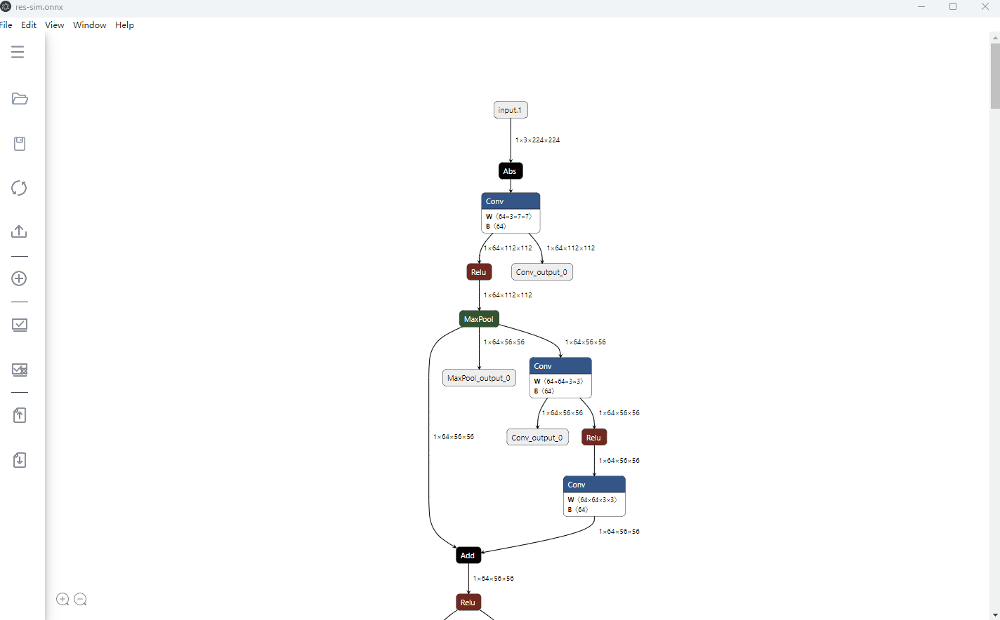
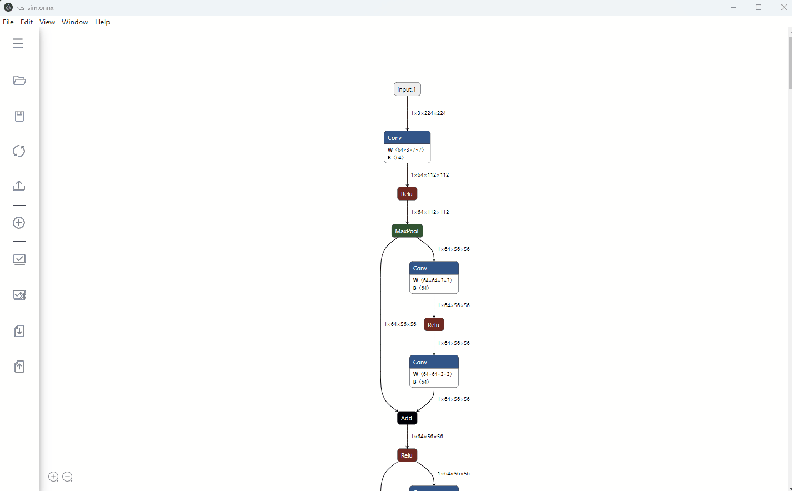
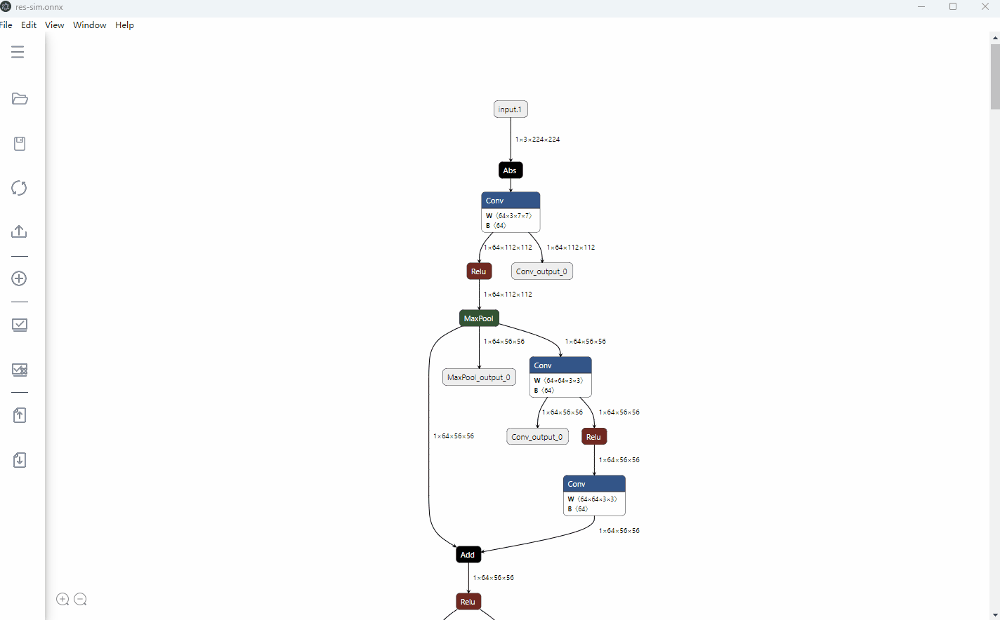
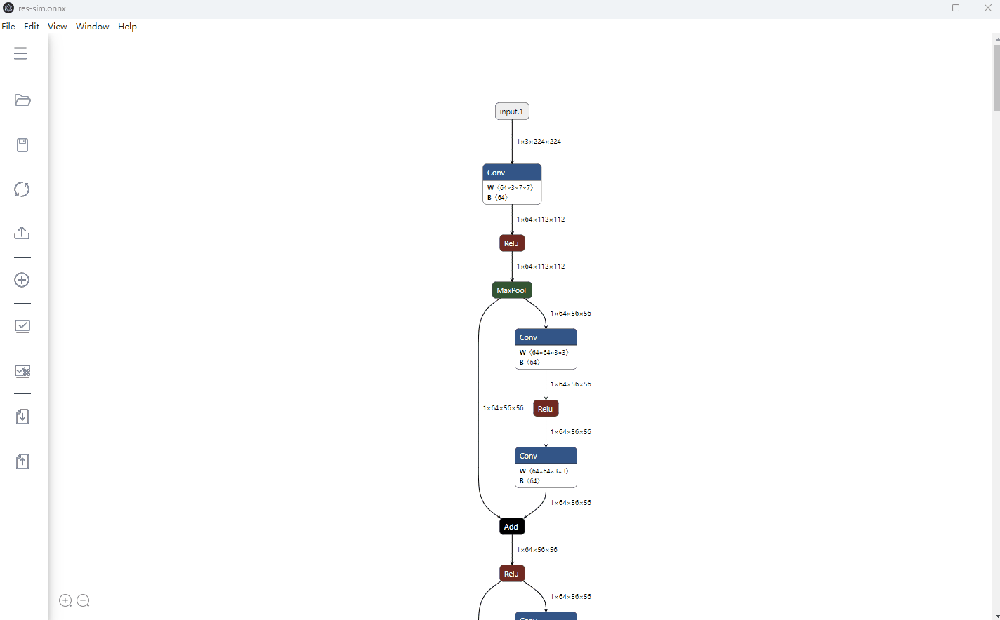
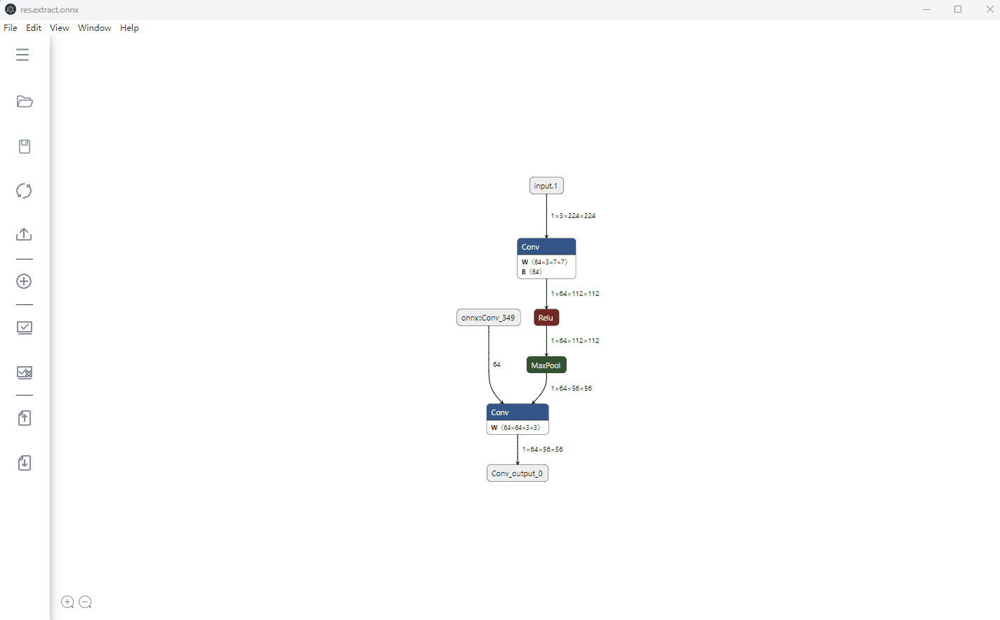
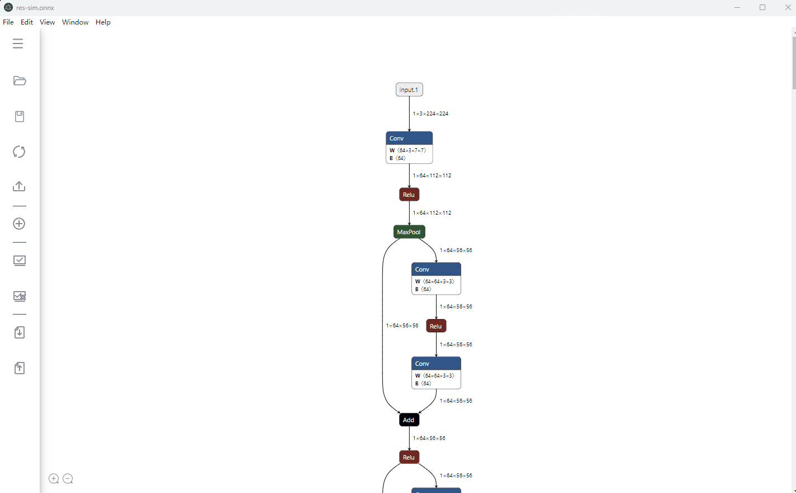
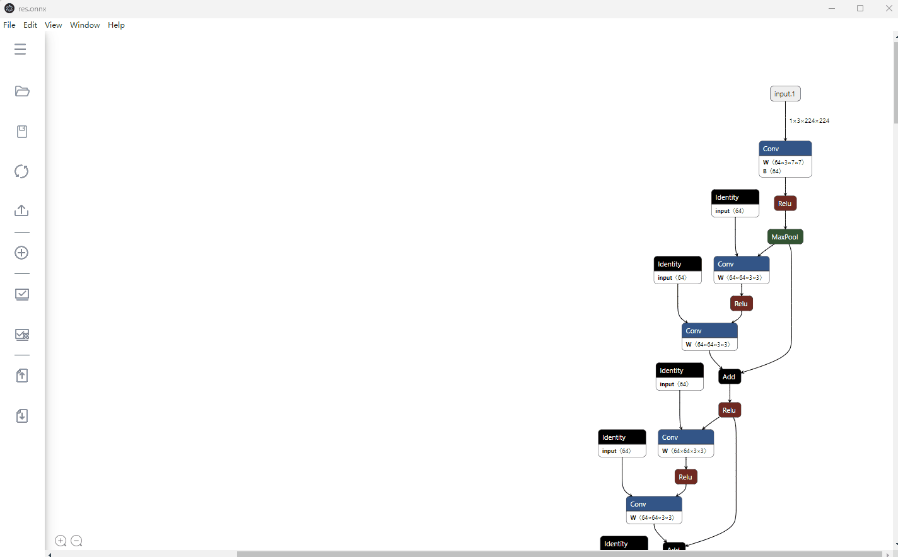

`ONNX`(Open Neural Network Exchange) 是一种针对机器学习所设计的开放式的文件格式，经常作为不同框架模型转化的中间文件。有时我们拿到ONNX文件，想将它进行一些修改，比如：

- **删除部分节点**。 比如，`ONNX`文件中一些前后处理的算子节点，以方便后续部署。
- **修改节点输入输出名**。 比如修改某一节点的输入输出名称，更改模型拓扑结构。
- **编辑节点属性值**。
- **增加新节点**。
- **编辑网络输入输出**

目前常用的方法是，先可视化模型图结构，然后基于`ONNX`的Python API编写脚本，对模型图结构进行编辑。但这可能需要我们在可视化-脚本-可视化-...之间反复横跳。而且在一张庞大的图上搜集想要修改的节点，也比较繁琐耗时。👋

能不能有一个工具，可以**实时预览编辑后的可视化效果，从而更方便，快捷，直观地实现`ONNX`模型的编辑**呢？:rocket: 这便是`onnx-modifier` ([github]())开发的动机。所有的编辑信息将最终汇总，统一送由ONNX Python API处理，得到编辑后的ONNX模型文件。

目前已支持下列操作：

:white_check_mark: 支持打开较大Onnx模型，超过1500个节点，可以使用局部图显示方式 <br>
:white_check_mark: 删除/恢复节点<br>
:white_check_mark: 修改节点输入输出名<br>
:white_check_mark: 修改模型输入输出名<br>
:white_check_mark: 增加模型输出节点<br>
:white_check_mark: 增加模型输入节点<br>
:white_check_mark: 编辑节点属性值<br>
:white_check_mark: 增加新节点<br>
:white_check_mark: 修改模型batch size<br>
:white_check_mark: 修改模型输入shape<br>
:white_check_mark: 修改模型initializers<br>

`onnx-modifier`基于流行的模型可视化工具 [Netron](https://github.com/lutzroeder/netron) 和[Electron](https://www.electronjs.org/)。希望它能给社区带来一些贡献~

# 安装与运行
您可以使用我们已经打包好的程序: [已打包程序](https://gitee.com/ascend/ait/wikis/OnnxModifier/%E6%89%93%E5%8C%85%20OnnxModifier%20)


目前支持三种方法运行`onnx-modifier`, Linux与windows安装流程一致，以下为安装运行说明：

## 源码拉取及第三方库安装

安装所需要的Python, NodeJS。拉取`ait`，并切换到 onnx-modifier 目录

1. 安装python
    * 建议安装[miniconda3](https://docs.conda.io/en/latest/miniconda.html)
    * 注意点: 在 windows 上，命令行的python命令优先会启动 WindowsApps 目录的程序，可以在环境变量中将 %USERPROFILE%\AppData\Local\Microsoft\WindowsApps 下移到最后
    * 验证是否安装成功: 命令行输入 `python --version`。能正常输出 python 版本即表示成功
2. 安装[NodeJS](https://nodejs.org/zh-cn/download)
    * 启动方式一和启动方式二使用 electron 启动时需要，建议安装最新长期维护版本
    * 如果是直接解压安装的方式，请将安装后的文件夹配置到环境变量PATH中
        - linux 需要配置 bin 目录
        - windows 配置解压目录即可
        - 验证是否安装成功：命令行输入 `node -v`。能正常输出 node 版本即表示成功
3. 拉取源码：
  ```bash
  git clone https://gitee.com/ascend/ait.git
  ```
4. 安装 ait 中的 surgeon 包, 提供 AutoOptimizer （基于知识库的整网优化） 和 Extract （子网导出） 功能, 请参考 ait 的安装流程，以下为参考步骤：
  ```bash
  cd ait/ait
  # windows 场景请直接执行：install.bat --surgeon
  # 添加执行权限
  chmod u+x install.sh
  # 1. 只安装debug下面的surgeon组件
  ./install.sh --surgeon
  # 安装完成之后返回仓库根目录
  ```
5. 安装 python 需要库
  ```bash
  cd ait/onnx-modifier
  pip install -r requirements.txt
  ```

## 启动方式一：编译成可执行程序启动
您可以使用我们已经打包好的程序: [已打包程序](https://gitee.com/ascend/ait/wikis/OnnxModifier/%E6%89%93%E5%8C%85%20OnnxModifier%20)


也可以选择自行编译，编译对环境网络要求较高, 如果遇到electron 无法安装失败问题，可以参考wiki: [electron 安装](https://gitee.com/ascend/ait/wikis/OnnxModifier/electron%20%E5%AE%89%E8%A3%85)

- 安装

  ```bash
  # 切到目录 ait/onnx-modifier 运行以下命令
  npm install  # npm是NodeJS的包管理器；
  ```
- 编译
  ```bash
  # 切到目录 ait/onnx-modifier 运行以下命令
  npm run make
  ```
- 安装运行
  编译之后，可以在out中看到打包的程序，解压运行即可

## 启动方式二：web服务器启动
- 安装
    1. 安装flask： pip install flask==2.2.2
    2. 如果运行报错，建议升级flask。建议版本2.2.2
- 运行，默认端口为5000（常用于调试开发）
  ```bash
  # 切到目录 ait/onnx-modifier 运行以下命令
  python flaskserver.py
  # 然后打开浏览器，打开 localhost:5000 即可访问到 onnx-modifier。
  # 因为安全考虑。仅支持运行命令的主机访问该端口，如果需要其他机器访问，建议使用ssh端口转发功能
  ```
- 命令行参数
  - 支持指定端口，参数为： --port [端口号]
  - 支持debug 模式，会打印更多日志，调试信息等，常用于开发场景，参数为： --debug
  - 支持指定默认打开的onnx文件，参数为： --onnx [onnx文件路径]
  ```bash
  # 样例
  python flaskserver.py --port 5000 --debug
  ```
- 安全风险
  * web服务器方式运行，会开启端口，如果在不可信任的多用户服务器中，可能端口被监听
  * 仅支持绑定localhost。如果在服务器中启动，在开发者本地是无法访问到的，建议使用ssh端口转发功能
- ssh 端口转发
    * 开启端口转发：比如将服务器（比如linux）的 loacalhost:5000 端口转发到本地(比如windows)的 8080 端口
    ```bash
    # 在windows本地运行
    # ssh -L [本地绑定端口8080]:localhost:[服务器端口5000] [用户名username]@[服务器地址serverhost]
    ssh -L 8080:localhost:5000 username@serverhost
    ```
    * 本地windows浏览器打开 localhost:8080 端口即可访问到linux服务器上的 onnx-modifier 服务

## 启动方式三：electron 命令行启动
- 安装
    1. 方式1：
        1. 下载electron: [v24.1.3版本下载地址](https://registry.npmmirror.com/binary.html?path=electron/24.1.3/)
            * linux 下载 electron-v24.1.3-linux-x64.zip 或 electron-v24.1.3-linux-arm64.zip
            * windows 下载 electron-v24.1.3-win32-x64.zip 或 electron-v24.1.3-win32-arm64.zip
        2. zip解压之后，将解压路径配置到环境变量的PATH中
    2. 方式2：
        直接 `npm install` , npm是NodeJS的包管理器。如果遇到electron 无法安装，可以参考wiki: [electron 安装](https://gitee.com/ascend/ait/wikis/OnnxModifier/electron%20%E5%AE%89%E8%A3%85)
- 运行（该方式启动常用于调试开发）
  ```bash
  # 切到目录 ait/onnx-modifier 运行以下命令
  electron .
  ```
  - 命令行参数
    - 支持指定onnx文件，参数为： --onnx [onnx文件路径]

# 用法

图结构层级的操作按钮放置在可视化页面的左上角，目前有五个：`Reset`，`Download`，`Add node`，`OnnxSim`， `AutoOptimizer`. 它们的功能分别为：

- `Reset`：重置模型图结构为导入时的初始状态；

- `Download`：保存编辑后的模型文件到本地。按钮右边的两个复选框（**对应功能可能还不够鲁棒**）
  - 如果选中`shape inferece`，那么会在保存模型时自动做[形状推导](https://github.com/onnx/onnx/blob/main/docs/ShapeInference.md)
  - 如果选中`clean up`，则会在保存时自动删掉无用节点 (类似[ONNX GraphSurgeon](https://docs.nvidia.com/deeplearning/tensorrt/onnx-graphsurgeon/docs/ir/graph.html#onnx_graphsurgeon.Graph.cleanup))。

- `Add node`：向当前模型中，添加新节点。

- `OnnxSim`， `AutoOptimizer`：模型自动优化

节点层级的操作都在节点侧边栏里，点击某一节点后即可弹出。

一起来详细康康。

## 删除/恢复节点

删除节点有两种模式：`Delete With Children` 和 `Delete Single Node`. 后者只删除当前单个节点；而前者还会自动删除以这个节点为根节点的所有子节点，当我们需要删除一长串节点时，这个功能会比较有用。

> `Delete With Children`基于回溯算法实现。

一个典型的删除操作如下图所示：



## 修改节点输入输出名

通过修改节点的输出输出名，我们可以对模型拓扑结构进行修改（如删除一些预处理/后处理节点）。该功能同样可以用在更改模型的输出的名称（即修改模型叶子节点的输出名）。

那在`onnx-modifer`中要怎么做呢？很简单，找到节点侧边栏的输入输出对应的输入框，键入新的名称就可以啦。图结构会根据键入的名称即时自动刷新。

上例的修改过程如下图所示：


## 修改模型输入输出名称

点击模型输入或输出节点，在弹出的侧边栏中，为模型输入输出键入新的名称即可。



## 增加模型输出节点

有时候我们需要增加/抽取某个特定节点的输出作为整个模型的输出。比如之前的模型输出节点在编辑过程中被删除了，需要增加新的，或者有时候我们需要抽取一些中间层特征输出做更细致的分析。

通过`onnx-modifier`，我们只需要在对应节点的侧边栏中，点击`Add Output`按钮即可在该节点后部增加一个模型输出节点，其名称与原节点的输出名相同。

如下图，我们增加了两个模型输出节点，分别为首个卷积层的输出和第二个卷积层的输出。


## 编辑节点属性值

在节点侧边栏对应的属性值输入框中，键入新的属性值即可。



## 增加新节点

有时候我们希望向模型中添加新节点。`onnx-modifier`已开始支持该功能。

在主页面的左方工具栏，有一个`Add node`按钮，点击之后弹出对话框，包含一个selector选择器，我们可以通过这二者的配合，完成节点的添加，只需3步：

1. 在selector中选择要添加的节点类型，在点击`Confirm`按钮后，一个对应类型的新节点将自动出现在图上。

   > * selector中包含来自`ai.onnx`(171), `ai.onnx.preview.training`(4), `ai.onnx.ml`(18) 和 `com.microsoft`(1)的所有节点类型。
   > * 注意：如果Model中的imports属性并未包含新增节点需要的版本（如`ai.onnx.preview.training`, `ai.onnx.ml`），新增节点可能会失败。

2. 点击这个新节点，在弹出的侧边栏中进行节点的编辑：
   - 节点属性：初始化为`null` （显示为`undefined`）。同上节，在对应的属性框中输入新值即可。
   - 修改节点输入输出名。输入输出名决定了节点将插入在图结构中的位置。
3. 完工（点击`Save`即可获得编辑后的ONNX模型）。


以下是该功能的一些提醒和小tip：

1. 点击节点侧边栏的`NODE PROPERTIES`的`type`框右侧的`?`，和节点属性框右侧的下拉按钮，可以显示关于当前节点类型/属性值的参考信息。
2. 为确保正确性，节点的各属性值建议全部填写（而不是留着`undefined`）。默认值在当前版本可能支持得还不够好。
3. 如果一个属性值是列表类型，则各元素之间使用‘`,`’分隔，无需'[]'。
4. 在当前版本中，如果一个节点的输入/输出是一个列表类型（如`Concat`），限制最多显示8个。如果一个节点实际输入/输出小于8个，则填写对应数目的输入输出即可，多出来的应以`list_custom`开头，它们会在后续处理中自动被忽略。


## 构造自定义算子

有时候我们希望向模型中增加自定义算子。`onnx-modifier`已开始支持该功能。

在主页面的左方工具栏，有一个`Add node`按钮，点击之后弹出对话框，通过按钮Edit Custom Operator按钮打开自定义文本框，按自己所需添加自定义算子，点击Add Operator按钮构造算子，成功后会重新加载json文件并自动添加自定义算子，后续添加节点过程如上：[增加新节点](#增加新节点)
注：需要添加正确的json格式（已经有默认输入），在后续如果不需要该自定义算子，可以依据输入的name，moudle与version并点击Delete Operator来删除构造的算子。


## 修改模型batch size
动态batch size和固定batch size均已支持。
- 动态batch size：点击`batch Dynamic`即可；
- 静态bacth size：在`batch Fixed`后方输入框内填入预期的batch size值；



## 修改模型initializers
有时候我们要修改一些保存在模型initializer中的数值，比如卷积层的权重/偏置参数，`Reshape`节点的`shape`参数等。使用`onnx-modifier`，这一操作将非常简单：在对应节点侧边栏的initializer中键入新的数值，点击`Download`即可。


> 如果要修改我们**新增加的**节点的initializer，除了键入其数值之外，还要键入其数据类型。（如果我们不确定数据类型，可以点击`NODE PROPERTIES->type->?`，在弹出的节点的详细介绍界面中，可能会找到线索。）

`onnx-modifer`正在活跃地更新中。 欢迎使用，提issue，如果有帮助的话，感谢给个:star:~

## 修改模型输入

有时候我们需要修改模型输入


## 操作回退重做

我们需要撤销操作或者重做操作的时候，可以在左侧菜单栏中点击`Undo`或者`Redo`来执行对应的操作，也可以使用`Ctrl+Z`快捷键执行回退及`Ctrl+Y`快捷键执行重做。(文件导出或存储类操作无法恢复)


## 修改导入导出

有时候我们需要固化修改。常用于训练之后参数做了一些修改，模型结构没有变化的情况。下面展示导出json 以及导入的操作方式



## 使用 OnnxSim 或者 AutoOptimizer 优化模型


## 子网导出



## 打开大模型
* 如果节点数量大于1500，可以选择使用局部图方式显示。可以大大加快模型打开速度。实测 30000 个节点模型，在 netron 中直接卡死，本程序可以使用局部图方式秒级打开
* 局部图是指针对某个节点，显示其前后的 100 个节点。可以选择显示前后的 50/100/200/300/400 个节点
* 显示其他节点局部图方式：
  - 如果该节点在当前图中，可以双击对应节点。会自动刷新显示对应节点的局部图，并定位到对应节点
  - 如果在当前图中没有显示，可以使用 Ctrl+F 显示所有的节点列表。双击要显示的节点，既可以显示对应的局部图
* 不建议在显示局部图时，对onnx进行修改操作


# 其他功能

## 打开om模型
.om格式的模型是昇腾AI处理器支持的离线模型。onnx-modifier在打开模型的过程中可以选择.om后缀的模型文件，onnx-modifier能够可视化其模型结构。注意，对于om模型**仅支持可视化，不支持改图操作**。

# 外部链接网址

| 网址                                      | 功能                                     |
|-------------------------------------------|-----------------------------------------|
| https://gitee.com/ascend/ait               | 本仓库位置      |
| https://github.com/ZhangGe6               | 该仓库原始仓库位置，在About菜单中展示      |
| https://arxiv.org/ | 算子说明信息        |
| https://github.com/onnx/onnx/ | 算子说明信息 |
| https://pytorch.org/docs/ | 算子说明信息 |
| https://docs.scipy.org/doc/ | 算子说明信息 |
| https://devblogs.nvidia.com/ | 算子说明信息 |
| https://github.com/numpy/numpy/issues/8621 | 算子说明信息 |
| https://en.wikipedia.org/wiki/ | 算子说明信息 |
| https://papers.nips.cc/paper/ | 算子说明信息 |
| https://ieeexplore.ieee.org/document | 算子说明信息 |

# 常见问题 Q&A

参考：[OnnxModify 常见问题](https://gitee.com/ascend/ait/wikis/OnnxModifier/OnnxModify%20%E5%B8%B8%E8%A7%81%E9%97%AE%E9%A2%98)

# 参考资料

- [Netron](https://github.com/lutzroeder/netron)
- [Flask](https://github.com/pallets/flask)
- ONNX IR [Official doc](https://github.com/onnx/onnx/blob/main/docs/IR.md)
- ONNX Python API [Official doc](https://github.com/onnx/onnx/blob/main/docs/PythonAPIOverview.md), [Leimao's Blog](https://leimao.github.io/blog/ONNX-Python-API/)
- ONNX IO Stream [Leimao's Blog](https://leimao.github.io/blog/ONNX-IO-Stream/)
- [onnx-utils](https://github.com/saurabh-shandilya/onnx-utils)
- [sweetalert](https://github.com/t4t5/sweetalert)
