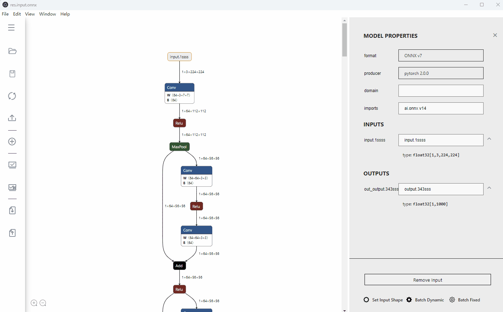
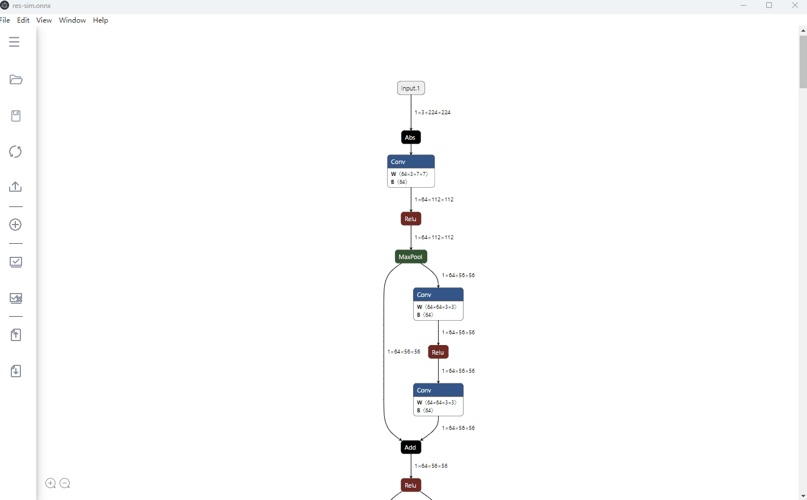
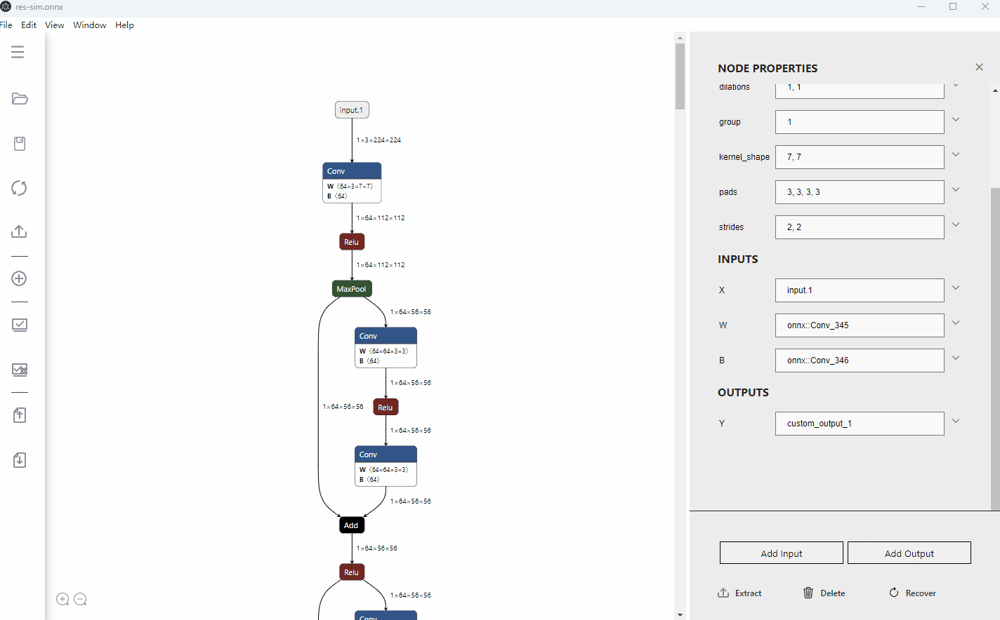
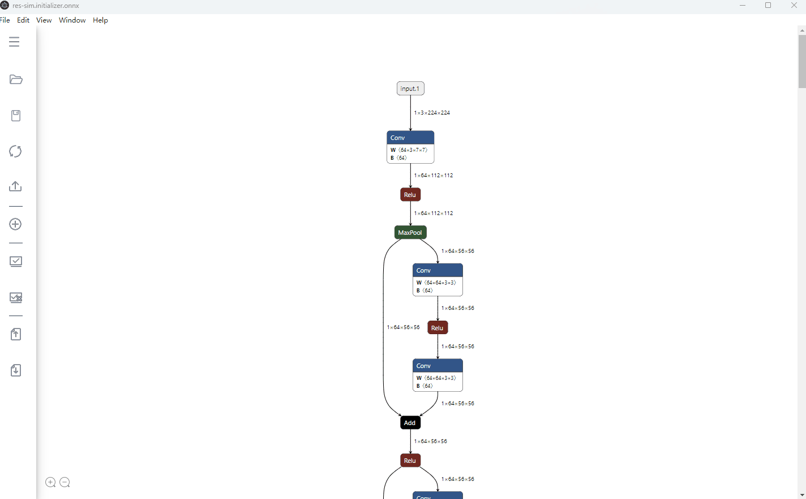
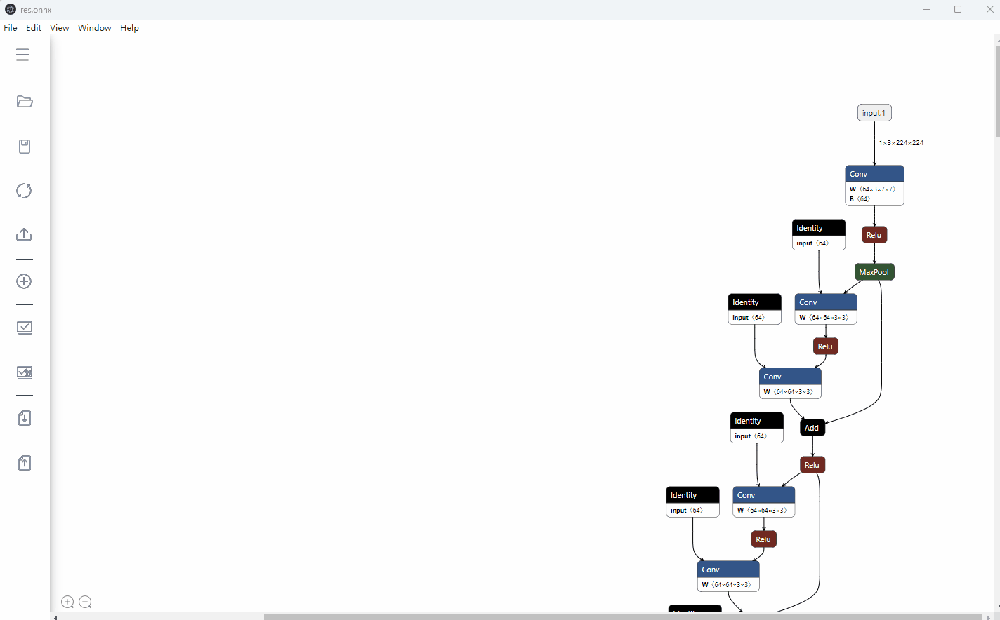

`ONNX`(Open Neural Network Exchange) 是一种针对机器学习所设计的开放式的文件格式，经常作为不同框架模型转化的中间文件。有时我们拿到ONNX文件，想将它进行一些修改，比如：

- **删除部分节点**。 比如，`ONNX`文件中一些前后处理的算子节点，以方便后续部署。
- **修改节点输入输出名**。 比如修改某一节点的输入输出名称，更改模型拓扑结构。
- **编辑节点属性值**。
- **增加新节点**。
- **编辑网络输入输出**

目前常用的方法是，先可视化模型图结构，然后基于`ONNX`的Python API编写脚本，对模型图结构进行编辑。但这可能需要我们在可视化-脚本-可视化-...之间反复横跳。而且在一张庞大的图上搜集想要修改的节点，也比较繁琐耗时。👋

能不能有一个工具，可以**实时预览编辑后的可视化效果，从而更方便，快捷，直观地实现`ONNX`模型的编辑**呢？:rocket: 这便是`onnx-modifier` ([github]())开发的动机。所有的编辑信息将最终汇总，统一送由ONNX Python API处理，得到编辑后的ONNX模型文件。

目前已支持下列操作：

:white_check_mark: 删除/恢复节点<br>
:white_check_mark: 修改节点输入输出名<br>
:white_check_mark: 修改模型输入输出名<br>
:white_check_mark: 增加模型输出节点<br>
:white_check_mark: 增加模型输入节点<br>
:white_check_mark: 编辑节点属性值<br>
:white_check_mark: 增加新节点<br>
:white_check_mark: 修改模型batch size<br>
:white_check_mark: 修改模型输入shape<br>
:white_check_mark: 修改模型initializers<br>

`onnx-modifier`基于流行的模型可视化工具 [Netron](https://github.com/lutzroeder/netron) 和[Electron](https://www.electronjs.org/)。希望它能给社区带来一些贡献~

# 安装与运行
目前支持两种方法运行`onnx-modifier`：

## 源码拉取及第三方库安装

- 拉取`ait`，并切换到 onnx-modifier目录，安装所需要的Python, node

  ```bash
  git clone https://gitee.com/ascend/ait.git
  cd ait/ait
  pip install . # 安装 ait 推理工具包
  cd -
  cd ait/onnx-modifier
  pip install -r requirements.txt
  npm install  # 如果electron 下载较慢，建议使用国内代理
  ```

## 命令行启动
- 运行（常用于调试开发）

  ```bash
  electron .
  ```

## 编译成可执行程序启动

- 编译
  ```bash
  npm run make
  ```
- 安装运行
  编译之后，可以在out中看到打包的程序，点击运行即可

## web服务器启动（不推荐使用）
- 运行，默认端口为5000（常用于调试开发）
  ```bash
  python flaskserver.py
  ```
- 支持指定端口，参数为： --port [端口号]
- 支持debug 模式，会打印更多日志，参数为： --debug
- 安全风险
  * web服务器方式运行，会开启端口，如果在不可信任的多用户服务器中，可能端口被监听
  * 仅支持绑定localhost。如果在服务器中启动，在开发者本地是无法访问到的，建议使用ssh端口转发功能
    ```bash
    # ssh -L [本地绑定端口]:localhost:[服务器端口] username@serverhost
    ssh -L 5000:localhost:5000 username@serverhost
    ```

# 用法

图结构层级的操作按钮放置在可视化页面的左上角，目前有五个：`Reset`，`Download`，`Add node`，`OnnxSim`， `AutOptimizer`. 它们的功能分别为：

- `Reset`：重置模型图结构为导入时的初始状态；

- `Download`：保存编辑后的模型文件到本地。按钮右边的两个复选框（**对应功能可能还不够鲁棒**）
  - 如果选中`shape inferece`，那么会在保存模型时自动做[形状推导](https://github.com/onnx/onnx/blob/main/docs/ShapeInference.md)
  - 如果选中`clean up`，则会在保存时自动删掉无用节点 (类似[ONNX GraphSurgeon](https://docs.nvidia.com/deeplearning/tensorrt/onnx-graphsurgeon/docs/ir/graph.html#onnx_graphsurgeon.Graph.cleanup))。

- `Add node`：向当前模型中，添加新节点。

- `OnnxSim`， `AutOptimizer`：模型自动优化

节点层级的操作都在节点侧边栏里，点击某一节点后即可弹出。

一起来详细康康。

## 删除/恢复节点

删除节点有两种模式：`Delete With Children` 和 `Delete Single Node`. 后者只删除当前单个节点；而前者还会自动删除以这个节点为根节点的所有子节点，当我们需要删除一长串节点时，这个功能会比较有用。

> `Delete With Children`基于回溯算法实现。

执行删除操作后，被删除的节点首先会变灰显示，以供预览。如果某一个节点被误删了，在该节点的侧边栏点击`Recover Node`即可以将其恢复到图中。预览确认删除操作无误后，点击`Enter`，图结构会刷新，显示节点删除后的状态。

一个典型的删除操作如下图所示：


## 修改节点输入输出名

通过修改节点的输出输出名，我们可以对模型拓扑结构进行修改（如删除一些预处理/后处理节点）。该功能同样可以用在更改模型的输出的名称（即修改模型叶子节点的输出名）。

那在`onnx-modifer`中要怎么做呢？很简单，找到节点侧边栏的输入输出对应的输入框，键入新的名称就可以啦。图结构会根据键入的名称即时自动刷新。

举个栗子，在下图所示的模型中，我们想要删除预处理对应的节点（`Sub->Mul->Sub->Transpose`），可以这样做：

1. 点击首个`Conv`节点，在弹出的属性栏中，将输入名称改为*serving_default_input:0* (`data_0`节点的输出名)；
2. 图结构自动刷新，可以发现，输入节点已经和首个`Conv`节点直接相连，几个预处理节点也已经从前向图中分离出来，将它们删除；
3. 完工（点击`Download`就可以获得编辑后的ONNX模型啦）。

> 如果我们希望通过修改，让节点$A$（比如上例中的`data_0`节点）连向节点$B$（比如上例中的首个`Conv`节点），建议的方式是：将节点$B$的输入名称修改为节点$A$的输出名称，而不是把$A$的输出名称修改为节点$B$的输入名称。 因为节点$B$的输入名称可能同时为其他节点（比如上例中的`Transpose`节点）的输出名称，会导致一些预料外的结果。

上例的修改过程如下图所示：



## 修改模型输入输出名称

点击模型输入或输出节点，在弹出的侧边栏中，为模型输入输出键入新的名称即可。


## 增加模型输出节点

有时候我们需要增加/抽取某个特定节点的输出作为整个模型的输出。比如之前的模型输出节点在编辑过程中被删除了，需要增加新的，或者有时候我们需要抽取一些中间层特征输出做更细致的分析。

通过`onnx-modifier`，我们只需要在对应节点的侧边栏中，点击`Add Output`按钮即可在该节点后部增加一个模型输出节点，其名称与原节点的输出名相同。

如下图，我们增加了两个模型输出节点，分别为首个卷积层的输出和第二个卷积层的输出。



## 编辑节点属性值

在节点侧边栏对应的属性值输入框中，键入新的属性值即可。

> 点击属性值输入框右侧的`+`，可显示该属性的参考信息。


## 增加新节点

有时候我们希望向模型中添加新节点。`onnx-modifier`已开始支持该功能。

在主页面的左上方，有一个`Add node`按钮和一个selector选择器，我们可以通过这二者的配合，完成节点的添加，只需3步：

1. 在selector中选择要添加的节点类型，在点击`Add node`按钮后，一个对应类型的新节点将自动出现在图上。

   > selector中包含来自`ai.onnx`(171), `ai.onnx.preview.training`(4), `ai.onnx.ml`(18) 和 `com.microsoft`(1)的所有节点类型。

2. 点击这个新节点，在弹出的侧边栏中进行节点的编辑：
   - 节点属性：初始化为`null` （显示为`undefined`）。同上节，在对应的属性框中输入新值即可。
   - 修改节点输入输出名。输入输出名决定了节点将插入在图结构中的位置。
3. 完工（点击`Download`即可获得编辑后的ONNX模型）。



以下是该功能的一些提醒和小tip：

1. 点击节点侧边栏的`NODE PROPERTIES`的`type`框右侧的`?`，和节点属性框右侧的`+`，可以显示关于当前节点类型/属性值的参考信息。
2. 为确保正确性，节点的各属性值建议全部填写（而不是留着`undefined`）。默认值在当前版本可能支持得还不够好。
3. 如果一个属性值是列表类型，则各元素之间使用‘`,`’分隔，无需'[]'。
4. 在当前版本中，如果一个节点的输入/输出是一个列表类型（如`Concat`），限制最多显示8个。如果一个节点实际输入/输出小于8个，则填写对应数目的输入输出即可，多出来的应以`list_custom`开头，它们会在后续处理中自动被忽略。

## 修改模型batch size
动态batch size和固定batch size均已支持。
- 动态batch size：点击`Dynamic batch size`即可；
- 动态bacth size：在`Fixed batch size`后方输入框内填入预期的batch size值；


## 修改模型initializers
有时候我们要修改一些保存在模型initializer中的数值，比如卷积层的权重/偏置参数，`Reshape`节点的`shape`参数等。使用`onnx-modifier`，这一操作将非常简单：在对应节点侧边栏的initializer中键入新的数值，点击`Download`即可。



> 如果要修改我们**新增加的**节点的initializer，除了键入其数值之外，还要键入其数据类型。（如果我们不确定数据类型，可以点击`NODE PROPERTIES->type->?`，在弹出的节点的详细介绍界面中，可能会找到线索。）

`onnx-modifer`正在活跃地更新中:hammer_and_wrench:。 欢迎使用，提issue，如果有帮助的话，感谢给个:star:~

## 修改模型输入

有时候我们需要修改模型输入


## 修改导出导出

有时候我们需要固化修改。常用于训练之后参数做了一些修改，模型结构没有变化的情况。下面展示导出json 以及导入的操作方式


## 使用OnnxSim 或者 AutoOptimizer 优化模型



# 参考资料

- [Netron](https://github.com/lutzroeder/netron)
- [Flask](https://github.com/pallets/flask)
- ONNX IR [Official doc](https://github.com/onnx/onnx/blob/main/docs/IR.md)
- ONNX Python API [Official doc](https://github.com/onnx/onnx/blob/main/docs/PythonAPIOverview.md), [Leimao's Blog](https://leimao.github.io/blog/ONNX-Python-API/)
- ONNX IO Stream [Leimao's Blog](https://leimao.github.io/blog/ONNX-IO-Stream/)
- [onnx-utils](https://github.com/saurabh-shandilya/onnx-utils)
- [sweetalert](https://github.com/t4t5/sweetalert)
